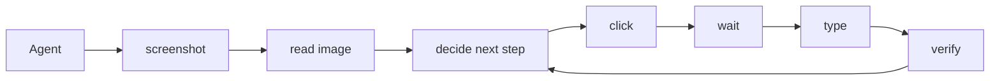

# AUV

[](LICENSE.md)

AUV means **Application Use Via**.

- Apple Music Application Use Via `auv-apple-music`...
- macOS Media Control Use Via `auv-media-macos`...
- Balatro (yes the game Balatro) Application Use Via `auv-game-balatro`...
- ... more, waiting for your implementation.

> Think of it as a programmable computer use, without agents.

For [Cua](https://github.com/trycua/cua) and similar computer-use projects, it
is common to execute `screenshot`, `read image`, `click`, `type`, `wait`, and
follow-up verification steps in sequence, then ask LLMs or agents to judge the
next move.



Many of those repeated sequences can be squashed into reusable GUI operations.
Opening an app, waiting for readiness, filling a form, and checking the result
should be callable as one command instead of spending tokens on the same
step-by-step loop every time.

Modern agents often use
[skills](https://developers.openai.com/api/docs/guides/tools-skills) or project
instructions to orchestrate tool calls, CLIs, and scripts. But built-in
computer-use surfaces, such as
[OpenAI Computer Use](https://developers.openai.com/api/docs/guides/tools-computer-use)
or [Claude Computer Use](https://docs.anthropic.com/en/docs/agents-and-tools/computer-use),
are still primarily interactive model-tool loops, not scriptable GUI automation
libraries.

<table>
<thead><tr><th>Tool-call loop</th><th>Rust reusable operation</th></tr></thead>
<tbody>
<tr><td>

```text
• Ran screenshot
  └ saved screen.png
• Ran read image screen.png
  └ form is visible
• Ran click "Email"
  └ clicked
• Ran type "user@example.com"
  └ typed
• Ran screenshot
  └ saved after.png
• Ran verify form state
  └ ready
```

</td><td>

```rust
pub fn open_and_fill_form(
  app: &mut AppSession,
  data: FormData,
) -> AuvResult<OperationResult> {
  app.open()?;
  app.wait_for_ready()?;
  app.fill(data)?;
  app.verify_submitted()
}
```

</td></tr>
<tr><td>

```text
• Ran screenshot
  └ saved page-1.png
• Ran OCR visible rows
  └ 12 rows
• Ran scroll
  └ scrolled down
• Ran OCR visible rows
  └ 10 rows, 4 repeated
• Ran guess when to stop
  └ uncertain
```

</td><td>

```rust
pub fn scan_visible_rows(
  region: &mut WindowRegion,
) -> AuvResult<ScrollScanArtifact> {
  region.scan_rows_until_stop()
}
```

</td></tr>
<tr><td>

```text
• Ran click target
  └ clicked
• Ran screenshot
  └ saved after-click.png
• Ran semantic check
  └ mismatch
• Ran retry manually
  └ repeated tool loop
```

</td><td>

```rust
pub fn verify_and_retry<F>(
  mut operation: F,
) -> AuvResult<OperationResult>
where
  F: FnMut() -> AuvResult<OperationResult>,
{
  retry_until_verified(&mut operation)
}
```

</td></tr>
</tbody></table>

Similar to [Playwright](https://playwright.dev/), AUV expects agents to write,
test, and improve reusable GUI automations for E2E tests and rapid application
actions.

AUV is not a computer-use agent. It does not ship an agent or harness. It offers
tools, CLIs, drivers, and verifiable observable results so agents can build
reusable GUI operations.

AUV is meant to work with coding agents and agent products such as:

- Codex
- Claude Code
- Pi Agent
- LobeHub

That means:

- If your agent can call a CLI, AUV can be used as computer use.
- If your agent can write code, AUV can save tokens by moving repeated GUI work
  into Rust commands today, with JavaScript/TypeScript and Python bindings
  planned after the contracts settle. Once a GUI flow is finalized as a command,
  repeated execution can approach zero reasoning-token cost.

## Why It Exists

Most GUI automation prototypes stop at "click this thing on screen." AUV keeps
the evidence that made an action possible and the evidence that proves what
happened after it:

- typed runtime calls instead of one-off scripts
- driver results with disturbance and fallback metadata
- durable run records and artifacts
- inspection APIs that read those records after the fact
- app-local Rust commands for workflows worth reusing

The active lane is the AUV core: invoke, run recording, artifacts, inspection,
app-local commands, and shared runtime reuse across frontends.

## Capability Matrix

Legend: ✅ supported, ⚠️ partial or platform-limited, ❌ not the focus.

| Capability | AUV | [Cua](https://github.com/trycua/cua) | [KWWKComputerUseCore](https://github.com/EYHN/kwwk-computer-use-core) / OpenBridge-style | Playwright/WebDriver |
| --- | --- | --- | --- | --- |
| Agent model | 💡 BYOA | 💡 BYOA + Agent | 💡 BYOA | ❌ |
| Scriptable | ✅ Rust today; JS/TS/Python planned | ⚠️ tool/API calls | ⚠️ Swift API | ✅ JS/TS/Python/... |
| Multi-driver | ✅ macOS ✅ Windows ⏳ Linux ⏳ Android ⏳ iOS | ✅ macOS/Linux/Windows sandbox focus | ⚠️ macOS-focused | ⚠️ browser engines across OSes |
| CLI | ✅ | ✅ | ❌ | ⚠️ via user scripts |
| MCP | ✅ | ✅ | ❌ | ❌ |
| RL Trajectory | ✅ runs + artifacts + inspect | ⚠️ trajectories/recordings | ❌ | ⚠️ traces/screenshots |
| Screenshot | ✅ | ✅ | ✅ | ✅ browser/page only |
| OCR | ✅ macOS OCR commands | ⚠️ model/tool dependent | ❌ | ❌ user code only |
| Image Match | ⚠️ template/image matching path exists | ⚠️ model/tool dependent | ❌ | ❌ user code only |
| AX (Accessibility Tree) | ✅ macOS AX tree | ✅ macOS AX tools | ✅ macOS AX snapshots | ⚠️ browser accessibility/DOM locators |
| AX Actions | ✅ AX press/focus/click paths | ✅ | ✅ | ✅ browser elements |
| Mouse / Click | ✅ global + window-relative | ✅ | ✅ snapshot coordinate click | ✅ browser viewport |
| Virtual Mouse / Background | ⚠️ macOS window-targeted paths; policy still evolving | ✅ strong macOS focus | ✅ strong macOS focus | ✅ browser-scoped, not desktop apps |
| Virtual Mouse / Foreground HID | ✅ | ✅ | ⚠️ mostly background-oriented | ✅ browser-scoped |
| Keyboard | ✅ foreground + target-aware paths | ✅ | ✅ | ✅ browser |
| Scroll | ✅ window/global scroll paths | ✅ | ✅ element scroll | ✅ DOM/page scroll |
| Scroll to List | ⚠️ visual rows + OCR artifacts exist; CLI surface retired while contracts settle | ❌ | ❌ | ✅ DOM lists, ❌ native visual lists |
| Bundled for Apps | ✅ app-local crates | ⚠️ agent/tool orchestration | ⚠️ product integration | ❌ browser-first |
| Feedback | ✅ `OperationResult` / `VerificationResult` / artifacts | ⚠️ tool outputs | ⚠️ structured metadata | ⚠️ assertions/traces |
| SLM friendly | ✅ compiled commands avoid repeated visual reasoning | ⚠️ depends on agent loop | ⚠️ depends on integration | ✅ inside browser scope |
| YOLO / Custom Models | ⚠️ inference crates and visual lanes exist | ⚠️ model/tool dependent | ❌ | ❌ user code only |

Scroll scan is a major reason AUV exists. Most desktop automation stacks can
scroll or read a screenshot, but they do not turn a native app's visual list into
page records, row candidates, crop artifacts, OCR fragments, and inspectable
stop reasons. AUV's current scroll-scan implementation is still contract work,
so the old public `scan window-region` CLI was removed until the reusable API is
clear.

**Feedback** means the automation returns machine-readable evidence after an
attempt: what input path was used, what changed, what artifacts were captured,
whether verification passed, and why an operation should retry, stop, or fail.

## Install

Install Rust first. This workspace uses Rust 2024 and currently requires the
toolchain declared in `Cargo.toml`.

Install directly from GitHub:

```sh
cargo install --git https://github.com/moeru-ai/auv auv-cli
auv --help
```

After installation, use the `auv` CLI directly:

```sh
auv --help
auv invoke --help
```

## Setup

### macOS Permissions

macOS automation needs OS permissions granted to the process that launches AUV,
usually your terminal app.

Open **System Settings -> Privacy & Security** and enable:

| Permission | Needed for |
| --- | --- |
| Accessibility | AX tree reads, focused element control, keyboard/pointer automation. |
| Screen Recording | Screenshots, OCR, visual inspection, and evidence capture. |
| Automation | AppleScript/System Events activation flows used by app probes and some drivers. |

After changing permissions, restart the terminal process and rerun:

```sh
auv permissions check
auv app probe com.apple.TextEdit
```

## Development

```sh
cargo fmt --check
cargo check
cargo test
git diff --check
cargo run -- --help
cargo run -- invoke --help
```

Useful entrypoints:

```sh
auv app probe <bundle-id>
auv app analyze .auv/app-probes/<probe>/probe.json
auv invoke <command-id> --help
auv inspect <run-id>
```

Use `docs/TERMS_AND_CONCEPTS.md` for shared vocabulary. Durable design and
evidence notes live under `docs/ai/references/`.

## License

[Apache License 2.0](LICENSE.md)
