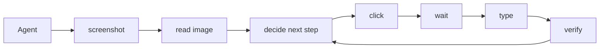

<p align="center">
  <picture>
    <source
      width="20%"
      srcset="./docs/assets/logo-short-height-dark.svg"
      media="(prefers-color-scheme: dark)"
    />
    <source
      width="20%"
      srcset="./docs/assets/logo-short-height-light.svg"
      media="(prefers-color-scheme: light), (prefers-color-scheme: no-preference)"
    />
    
  </picture>
</p>

<h1 align="center">AUV</h1>

[](LICENSE.md)

AUV means **Application Use Via ...**.

- Apple Music Application Use Via [`auv-apple-music`](https://github.com/moeru-ai/auv/tree/main/crates/auv-apple-music)...
- macOS Media Control Use Via [`auv-media-macos`](https://github.com/moeru-ai/auv/tree/main/crates/auv-media-macos)...
- [Balatro](https://www.playbalatro.com/) (yes the game [Balatro](https://www.playbalatro.com/)) Application Use Via [`auv-game-balatro`](https://github.com/moeru-ai/auv/tree/main/crates/auv-game-balatro)...
- ... more, waiting for your implementation.

> Think of it as a programmable computer use, without agents.

## Install

Install Rust first. This workspace uses Rust 2024 and currently requires the
toolchain declared in `Cargo.toml`.

Install directly from GitHub:

```sh
cargo install --git https://github.com/moeru-ai/auv --package auv-cli --bin auv
auv --help
```

After installation, use the `auv` CLI directly:

```sh
auv --help
auv invoke --help
```

## Setup

### macOS Permissions

macOS automation needs OS permissions granted to the process that launches AUV,
usually your terminal app.

Open **System Settings -> Privacy & Security** and enable:

| Permission | Needed for |
| --- | --- |
| Accessibility | AX tree reads, focused element control, keyboard/pointer automation. |
| Screen Recording | Screenshots, OCR, visual inspection, and evidence capture. |
| Automation | AppleScript/System Events activation flows used by app probes and some drivers. |

After changing permissions, restart the terminal process and rerun:

```sh
auv permissions check
auv app probe com.apple.TextEdit
```

## Understand AUV

For [Cua](https://github.com/trycua/cua), [`agent-browser`](https://github.com/vercel/agent-browser), and
similar computer-use projects, it is common to execute `screenshot`, `read image`, `click`, `type`,
`wait`, and follow-up verification steps in sequence, then ask LLMs or agents to judge the next move.



Many of those repeated sequences can be squashed into reusable GUI operations.
Opening an app, waiting for readiness, filling a form, and checking the result
should be callable as one command instead of spending tokens on the same
step-by-step loop every time.

Modern agents often use
[skills](https://developers.openai.com/api/docs/guides/tools-skills) or project
instructions to orchestrate tool calls, CLIs, and scripts. But built-in
computer-use surfaces, such as
[OpenAI Computer Use](https://developers.openai.com/api/docs/guides/tools-computer-use)
or [Claude Computer Use](https://docs.anthropic.com/en/docs/agents-and-tools/computer-use),
are still primarily interactive model-tool loops, not scriptable GUI automation
libraries.

<table>
<thead><tr><th>Tool-call loop</th><th>Rust scripts</th></tr></thead>
<tbody>
<tr><td>

```text
• Ran screenshot
  └ saved screen.png
• Ran read image screen.png
  └ form is visible
• Ran click "Email"
  └ clicked
• Ran type "user@example.com"
  └ typed
• Ran screenshot
  └ saved after.png
• Ran verify form state
  └ ready
```

</td><td>

```rust
pub fn open_and_fill_form(
  app: &mut AppSession,
  data: FormData,
) -> AuvResult<OperationResult> {
  app.open()?;
  app.wait_for_ready()?;
  app.fill(data)?;
  app.verify_submitted()
}
```

</td></tr>
<tr><td>

```text
• Ran screenshot
  └ saved page-1.png
• Ran OCR visible rows
  └ 12 rows
• Ran scroll
  └ scrolled down
• Ran OCR visible rows
  └ 10 rows, 4 repeated
• Ran guess when to stop
  └ uncertain
```

</td><td>

```rust
pub fn scan_visible_rows(
  region: &mut WindowRegion,
) -> AuvResult<ScrollScanArtifact> {
  region.scan_rows_until_stop()
}
```

</td></tr>
<tr><td>

```text
• Ran click target
  └ clicked
• Ran screenshot
  └ saved after-click.png
• Ran semantic check
  └ mismatch
• Ran retry manually
  └ repeated tool loop
```

</td><td>

```rust
pub fn verify_and_retry<F>(
  mut operation: F,
) -> AuvResult<OperationResult>
where
  F: FnMut() -> AuvResult<OperationResult>,
{
  retry_until_verified(&mut operation)
}
```

</td></tr>
</tbody></table>

Similar to [Playwright](https://playwright.dev/), AUV expects agents to write,
test, and improve reusable GUI automations for E2E tests and rapid application
actions.

AUV is not a computer-use agent. It does not ship an agent or harness. It offers
tools, CLIs, drivers, and verifiable observable results so agents can build
reusable GUI operations.

AUV is meant to work with coding agents and agent products such as:

- [Apeira](https://apeira.moeru.ai)
- [Codex](https://chatgpt.com/codex/)
- [Claude Code](https://claude.com/product/claude-code)
- [Pi Agent](https://github.com/earendil-works/pi)
- [LobeHub](https://github.com/lobehub/lobehub)
- [Kimi CLI](https://www.kimi.com/code)
- ... bring your own

That means:

- If your agent can call a CLI, AUV can be used as computer use.
- If your agent can write code, AUV can save tokens by moving repeated GUI work
  into Rust commands today, with JavaScript/TypeScript and Python bindings
  planned after the contracts settle. Once a GUI flow is finalized as a command,
  repeated execution can approach zero reasoning-token cost.

## Why even build AUV?

AUV born from the grounding knowledge of building general gaming agents for [Project AIRI](https://github.com/moeru-ai/airi), since 2024, we tried to build agents to allow LLMs to play the following games, you can find how we implement the agents in the following repos:

- [Balatro](https://github.com/proj-airi/game-playing-ai-balatro)
- [Kerbal Space Program](https://github.com/proj-airi/game-playing-ai-kerbal-space-program)
- [Factorio](https://github.com/moeru-ai/airi-factorio)
- [Dome Keeper](https://github.com/proj-airi/game-playing-ai-dome-keeper)

> There are more games we implemented where you can find in [Project AIRI](https://github.com/moeru-ai/airi) organization, but these four requires YOLO, OCR, screen understanding, and computer-use capabilities.
>
> Now you have the framework to build for any applications, games.

Since Vercel published the [`agent-browser`](https://github.com/vercel/agent-browser), we fell in love with it and have it assisted agents to build many web projects, but we found that the loop it requires for agents to call `agent-browser` CLI to execute the commands is too slow and inefficient, while in computer use world, many operations can be repeated thousands of times, just like how Playwright/Vitest would allow us to write E2E test for applications, why don't we expand this idea of writing code to control application to computer use world?

## Capability Matrix

> What AUV can do, compared to other computer-use projects.

| Capability | AUV | [Cua](https://github.com/trycua/cua) | [OpenBridge](https://github.com/AFK-surf/OpenBridge) / [KWWKComputerUseCore](https://github.com/EYHN/kwwk-computer-use-core) | Playwright |
| --- | --- | --- | --- | --- |
| Agent model | 💡 BYOA | 💡 BYOA + Built-in Agent | 💡 BYOA + Built-in Agent | ❌ |
| Scriptable | ✅ Rust ⏳ JS/TS/Python | ⚠️ Tools only | ⚠️ Swift Only | ✅ JS/TS/Python/... |
| Multi-driver | ✅ macOS/Windows ⏳ Linux/Android/iOS | ✅ | ❌ | ❌ |
| CLI | ✅ | ✅ | ❌ | ⚠️ via user scripts |
| MCP | ✅ | ✅ | ❌ | ❌ |
| RL Trajectory | ✅ runs + o11y (OTEL compatible) + artifacts | ⚠️ recordings | ❌ | ✅ |
| Screenshot | ✅ | ✅ | ✅ | ✅ browser only |
| OCR | ✅ BYOK / OS OCR | ⚠️ BYOK | ❌ | ❌ |
| Image Match | ✅ | ✅ | ❌ | ❌ user code only |
| AX (Accessibility Tree) | ✅ macOS/Windows | ✅ macOS | ✅ macOS | ⚠️ Browser only |
| AX Actions | ✅ | ✅ | ✅ | ⚠️ browser only |
| Mouse / Click | ✅ | ✅ | ✅ | ⚠️ Browser only |
| Virtual Mouse / Background | ✅ macOS/Windows | ✅ macOS focused | ✅ macOS focused | ⚠️ Browser only |
| Virtual Mouse / Foreground HID | ✅ | ✅ | ❌ | ⚠️ Browser only |
| Keyboard | ✅ | ✅ | ✅ | ⚠️ Browser Only |
| Scroll | ✅ | ✅ | ✅ | ⚠️ Browser Only |
| Scroll to List | ✅ | ❌ | ❌ | ✅ |
| Bundled for Apps | ✅ | ❌ | ❌ | ❌ |
| Feedback | ✅ Agent understand whether clicked or typed | ⚠️ tool outputs | ⚠️ structured metadata | ⚠️ assertions/traces |
| SLM friendly | ✅ Bundled for Apps | ⚠️ Agent orchestrated | ⚠️ Agent ochestrated | ✅ |
| YOLO / Custom Models | ✅ | ✅ | ❌ | ❌ |

- **Scroll scan** is a major reason AUV exists. Most desktop automation stacks can
scroll or read a screenshot, but they do not turn a native app's visual list into
page records, row candidates, crop artifacts, OCR fragments, and inspectable
stop reasons. AUV's current scroll-scan implementation is still contract work,
so the old public `scan window-region` CLI was removed until the reusable API is
clear.
- **Feedback** means the automation returns machine-readable evidence after an
attempt: what input path was used, what changed, what artifacts were captured,
whether verification passed, and why an operation should retry, stop, or fail.

## Development

```sh
cargo fmt --check
cargo check
cargo test
git diff --check
cargo run -- --help
cargo run -- invoke --help
```

Useful entrypoints:

```sh
auv app probe <bundle-id>
auv app analyze .auv/app-probes/<probe>/probe.json
auv invoke <command-id> --help
auv inspect <run-id>
```

Use `docs/TERMS_AND_CONCEPTS.md` for shared vocabulary. Durable design and
evidence notes live under `docs/ai/references/`.

## Related

> [!NOTE]
>
> This project is part of the [Project AIRI](https://github.com/moeru-ai/airi) ecosystem.

## Acknowledgements

- [MaaFramework](https://github.com/MaaXYZ/MaaFramework)
- [CUA](https://github.com/trycua/cua)
- [KWWKComputerUseCore](https://github.com/EYHN/kwwk-computer-use-core)
- [Playwright](https://github.com/microsoft/playwright)
- [WebDriver](https://developer.mozilla.org/en-US/docs/Web/WebDriver)
- [Appium](https://github.com/appium/appium-mac2-driver)
- [OpenBridge](https://github.com/AFK-surf/OpenBridge)

## Special Thanks

Special thanks to all contributors for their contributions to auv ❤️

<a href="https://github.com/moeru-ai/auv/graphs/contributors">
  
</a>

## Star History

<a href="https://star-history.com/#moeru-ai/auv&Date">
  <picture>
    <source media="(prefers-color-scheme: dark)" srcset="https://api.star-history.com/svg?repos=moeru-ai/auv&type=Date&theme=dark" />
    <source media="(prefers-color-scheme: light)" srcset="https://api.star-history.com/svg?repos=moeru-ai/auv&type=Date" />
    
  </picture>
</a>

## License

[Apache License 2.0](LICENSE.md)
