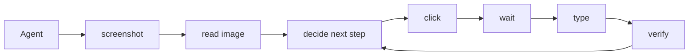
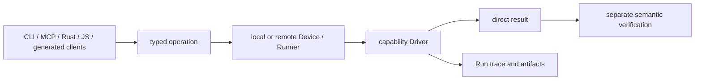

<p align="center">
  <picture>
    <source
      width="30%"
      srcset="./docs/assets/logo-short-height-dark.svg"
      media="(prefers-color-scheme: dark)"
    />
    <source
      width="30%"
      srcset="./docs/assets/logo-short-height-light.svg"
      media="(prefers-color-scheme: light), (prefers-color-scheme: no-preference)"
    />
    
  </picture>
</p>

<h1 align="center">AUV</h1>

[](LICENSE.md)

AUV means **Application Use Via ...**.

- Apple Music Application Use Via [`auv-apple-music`](https://github.com/moeru-ai/auv/tree/main/supported/apps/auv-apple-music)...
- macOS Media Control Use Via [`auv-media-macos`](https://github.com/moeru-ai/auv/tree/main/crates/auv-media-macos)...
- [Balatro](https://www.playbalatro.com/) (yes the game [Balatro](https://www.playbalatro.com/)) Application Use Via [`auv-game-balatro`](https://github.com/moeru-ai/auv/tree/main/supported/games/auv-game-balatro)...
- ... more, waiting for your implementation.

> Think of it as a programmable computer use, without agents.

<!-- START doctoc generated TOC please keep comment here to allow auto update -->
<!-- DON'T EDIT THIS SECTION, INSTEAD RE-RUN doctoc TO UPDATE -->
## Table of Contents

- [Getting Started](#getting-started)
- [Understand AUV](#understand-auv)
- [Why even build AUV?](#why-even-build-auv)
- [Capability Matrix](#capability-matrix)
- [Development](#development)
- [Related](#related)
- [Acknowledgements](#acknowledgements)
- [Special Thanks](#special-thanks)
- [Star History](#star-history)
- [License](#license)

<!-- END doctoc generated TOC please keep comment here to allow auto update -->

## Getting Started

### Install

Install a prebuilt release:

#### macOS

```sh
brew install moeru-ai/tap/auv
auv --version
```

Alternatively, without [Homebrew](https://brew.sh/):

```sh
curl -fsSL https://raw.githubusercontent.com/moeru-ai/auv/main/install/install.sh | sh
```

#### Linux

```sh
curl -fsSL https://raw.githubusercontent.com/moeru-ai/auv/main/install/install.sh | sh
auv --version
```

> [!NOTE]
>
> Set `AUV_VERSION` or `AUV_INSTALL_DIR` to change the release version or the
> install directory (default: `~/.local/bin`).

#### Windows

##### Scoop

```powershell
scoop bucket add auv https://github.com/moeru-ai/auv
scoop install auv/auv
auv --version
```

##### Manual installation

Download the archive for your architecture:

- [x86-64](https://github.com/moeru-ai/auv/releases/latest/download/auv-x86_64-pc-windows-msvc.zip)
- [ARM64](https://github.com/moeru-ai/auv/releases/latest/download/auv-aarch64-pc-windows-msvc.zip)

Extract the archive to a permanent directory. Add that directory to your user
`PATH`. The archive contains a single `auv.exe`; the Windows helper is embedded.

### Install with proto

Install and configure [proto](https://moonrepo.dev/docs/proto) first. Then add
the AUV plugin and install the latest release:

```sh
proto plugin add auv "https://raw.githubusercontent.com/moeru-ai/auv/main/toolchain/proto/auv.toml" --to global
proto install auv latest --config-mode global --pin global
auv --version
```

> [!NOTE]
>
> `AUV Helper.app` for macOS is included in the `proto` installation. On
> Windows, `auv-helper.exe` is embedded in `auv.exe` and extracted only by the
> elevated helper setup command.

> [!WARNING]
>
> Linux musl is not supported. (But PRs are welcomed!)

### Install with Nix

Install [Nix](https://nixos.org/download/) 2.27 or later and enable the
`nix-command` and `flakes` experimental features. On macOS, install Apple's
build tools first:

```sh
xcode-select --install
```

Then install the default AUV package from this repository:

```sh
nix profile install 'git+https://github.com/moeru-ai/auv#default'
auv --version
```

The `git+https` transport is required so Nix fetches AUV's Git submodules. The
flake defines source-built packages for Apple Silicon and Intel macOS and for
x86-64 and ARM64 Linux. The package does not support Windows or Linux musl.

The Nix package does not embed the signed `AUV Helper.app`. On macOS, use
Homebrew, proto, or a direct release download if you need to run
`auv setup macos-helper install` with the official helper.

### Install with Cargo

Prerequisites: [Rust](https://www.rust-lang.org/tools/install) and the platform
build tools below. AUV includes the Protobuf sources, so Buf is not required.

> [!WARNING]
> `cargo install` does not include AUV Helper. Use an install method above if
> you need it.

#### macOS

Install the Xcode Command Line Tools:

```sh
xcode-select --install
cargo install --git https://github.com/moeru-ai/auv auv-cli --bin auv
auv --version
```

#### Linux

On Ubuntu or Debian, install the native build dependencies:

```sh
sudo apt-get update
sudo apt-get install -y \
  pkg-config libclang-dev libxcb1-dev libxrandr-dev libdbus-1-dev \
  libpipewire-0.3-dev libwayland-dev libxkbcommon-dev libegl-dev \
  libleptonica-dev libtesseract-dev
cargo install --git https://github.com/moeru-ai/auv auv-cli --bin auv
auv --version
```

> [!NOTE]
> Other Linux distributions can use different package names.

#### Windows

Install Rust with the MSVC toolchain, Visual Studio Build Tools, and the
Windows SDK.

```powershell
cargo install --git https://github.com/moeru-ai/auv auv-cli --bin auv
auv --version
```

### Setup

#### macOS

Official macOS releases include the signed `AUV Helper.app`. On macOS 13 or
later, install it for the current user:

```sh
auv setup macos-helper install
auv setup macos-helper status
```

> [!TIP]
> The installation does not require `sudo` or an administrator password.

If macOS requests approval, open the Background Items and Accessibility
settings:

```sh
auv setup macos-helper open-background-items-settings
auv setup macos-helper open-accessibility-settings
```

> [!NOTE]
> Projects that integrate AUV can rebrand `AUV Helper.app`. They can change its
> name, icon, bundle identifier, and Apple Developer signing identity. See
> [Shipped helper identity](crates/auv-device-helper-macos/README.md#shipped-helper-identity)
> for packaging options.

Grant these permissions to the application that starts AUV, usually your
terminal application:

| Permission | Needed for |
| --- | --- |
| Accessibility | AX tree reads, focused element control, keyboard/pointer automation. |
| Screen Recording | Screenshots, OCR, visual inspection, and evidence capture. |
| Automation | AppleScript/System Events app activation and foreground fallback paths. |

After you change the permissions, restart the terminal. Then run:

```sh
auv doctor
auv invoke app.probePermissions
```

#### Windows

> [!IMPORTANT]
> The Windows setup commands require an elevated PowerShell.

```powershell
auv setup windows-helper install
auv setup windows-helper status
```

> [!NOTE]
> The setup command extracts the `auv-helper.exe` that is embedded in `auv.exe`
> into `%ProgramFiles%\AUV`. Then it registers that file as the LocalSystem
> `AuvHelper` service. The Helper does not listen on the network. Lock and
> unlock work through an ordinary `auv serve` that runs as the logged-in user.
> To accept paired Devices from the network, start that daemon with
> `--listen http://0.0.0.0:9847`. An installation from 0.0.28 is migrated in
> place: the old `AuvDevice` service is removed, enrolled PINs are kept, and
> paired clients must pair again with the new daemon.

### Uninstall

Use the instructions that match your installation method. If a platform Helper
is installed, remove it first.

#### macOS

```sh
auv setup macos-helper uninstall
brew uninstall auv
```

> [!NOTE]
> Helper removal keeps the enrollment data in the login Keychain. It also keeps
> other AUV data in the Application Support directory.

#### Linux

```sh
rm "$HOME/.local/bin/auv"
```

#### Windows

Run these commands from an elevated PowerShell:

```powershell
auv setup windows-helper uninstall
scoop uninstall auv
```

> [!NOTE]
> Helper removal keeps the enrolled PINs in `%ProgramData%`. The daemon's own
> pairing and policy data stays in its store.

If you installed the ZIP manually, remove its directory from the file system.
Then remove that directory from `PATH`.

#### Cargo

```sh
cargo uninstall auv-cli
```

## Understand AUV

For [Cua](https://github.com/trycua/cua), [`agent-browser`](https://github.com/vercel/agent-browser), and
similar computer-use projects, it is common to execute `screenshot`, `read image`, `click`, `type`,
`wait`, and follow-up verification steps in sequence, then ask LLMs or agents to judge the next move.


```mermaid
flowchart LR
  A[Agent] --> B[screenshot]
  B --> C[read image]
  C --> D[decide next step]
  D --> E[click]
  E --> F[wait]
  F --> G[type]
  G --> H[verify]
  H --> D
```

Many of those repeated sequences can be squashed into reusable GUI operations.
Opening an app, waiting for readiness, filling a form, and checking the result
should be callable as one command instead of spending tokens on the same
step-by-step loop every time.

Modern agents often use
[skills](https://developers.openai.com/api/docs/guides/tools-skills) or project
instructions to orchestrate tool calls, CLIs, and scripts. But built-in
computer-use surfaces, such as
[OpenAI Computer Use](https://developers.openai.com/api/docs/guides/tools-computer-use)
or [Claude Computer Use](https://docs.anthropic.com/en/docs/agents-and-tools/computer-use),
are still primarily interactive model-tool loops, not scriptable GUI automation
libraries.

Similar to [Playwright](https://playwright.dev/), what if we could organize those actions
into executable scripts, reusable?

<table>
<thead><tr><th>Tool-call loop</th><th>Rust scripts</th></tr></thead>
<tbody>
<tr><td>

```text
• Ran screenshot
  └ saved screen.png
• Ran read image screen.png
  └ form is visible
• Ran click "Email"
  └ clicked
• Ran type "user@example.com"
  └ typed
• Ran screenshot
  └ saved after.png
• Ran verify form state
  └ ready
```

</td><td>

```rust
pub fn open_and_fill_form(
  app: &mut AppSession,
  data: FormData,
) -> AuvResult<OperationResult> {
  app.open()?;
  app.wait_for_ready()?;
  app.fill(data)?;
  app.verify_submitted()
}
```

</td></tr>
<tr><td>

```text
• Ran screenshot
  └ saved page-1.png
• Ran OCR visible rows
  └ 12 rows
• Ran scroll
  └ scrolled down
• Ran OCR visible rows
  └ 10 rows, 4 repeated
• Ran guess when to stop
  └ uncertain
```

</td><td>

```rust
pub fn scan_visible_rows(
  region: &mut WindowRegion,
) -> AuvResult<ScrollScanArtifact> {
  region.scan_rows_until_stop()
}
```

</td></tr>
<tr><td>

```text
• Ran click target
  └ clicked
• Ran screenshot
  └ saved after-click.png
• Ran semantic check
  └ mismatch
• Ran retry manually
  └ repeated tool loop
```

</td><td>

```rust
pub fn verify_and_retry<F>(
  mut operation: F,
) -> AuvResult<OperationResult>
where
  F: FnMut() -> AuvResult<OperationResult>,
{
  retry_until_verified(&mut operation)
}
```

</td></tr>
</tbody></table>

AUV expects agents to write, test, and improve reusable GUI automation for E2E
tests and rapid application actions.

In fact, AUV is not a computer-use agent. It does not ship an agent or harness.
It offers tools, CLIs, drivers, and verifiable observable results so agents can
build reusable GUI operations.

AUV is meant to work with coding agents and agent products such as:

- [Apeira](https://apeira.moeru.ai)
- [Codex](https://chatgpt.com/codex/)
- [Claude Code](https://claude.com/product/claude-code)
- [Pi Agent](https://github.com/earendil-works/pi)
- [LobeHub](https://github.com/lobehub/lobehub)
- [Kimi CLI](https://www.kimi.com/code)
- ... bring your own

That means:

- If your agent can call a CLI, AUV can be used as computer use.
- If your agent can write code, AUV can move repeated GUI work into reusable
  Rust or JavaScript/TypeScript operations. Once a GUI flow is finalized as an
  operation, repeated execution can approach zero reasoning-token cost.
- AUV's daemon and extension APIs use versioned Protobuf/gRPC contracts. A
  language with compatible Protobuf/gRPC generators can generate a client for
  those contracts without AUV inventing another language-specific protocol.
  First-party SDK quality, packaging, and documentation are still separate
  support claims: Rust and JavaScript/TypeScript are available today, while a
  first-party Python SDK remains planned.

The reusable pieces are split by responsibility, but they use one execution
model instead of becoming unrelated wrappers:


```mermaid
flowchart LR
  A[CLI / MCP / Rust / JS / generated clients] --> B[typed operation]
  B --> C[local or remote Device / Runner]
  C --> D[capability Driver]
  D --> E[direct result]
  D --> F[Run trace and artifacts]
  E --> G[separate semantic verification]
```

Drivers own platform capabilities, operation crates own reusable workflows,
and `auv-tracing` owns Run evidence and artifacts. The visual overlay remains a
separate trust and debugging surface; drawing a cursor never stands in for
input delivery or semantic verification. This package structure lets another
frontend or generated language client reuse the same operations rather than
reimplementing them around the CLI.

## Why even build AUV?

AUV born from the grounding knowledge of building general gaming agents for [Project AIRI](https://github.com/moeru-ai/airi), since 2024, we tried to build agents to allow LLMs to play the following games, you can find how we implement the agents in the following repos:

- [Balatro](https://github.com/proj-airi/game-playing-ai-balatro)
- [Kerbal Space Program](https://github.com/proj-airi/game-playing-ai-kerbal-space-program)
- [Factorio](https://github.com/moeru-ai/airi-factorio)
- [Dome Keeper](https://github.com/proj-airi/game-playing-ai-dome-keeper)

> There are more games we implemented where you can find in [Project AIRI](https://github.com/moeru-ai/airi) organization, but these four requires YOLO, OCR, screen understanding, and computer-use capabilities.
>
> Now you have the framework to build for any applications, games.

Since Vercel published the [`agent-browser`](https://github.com/vercel/agent-browser), we fell in love with it and have it assisted agents to build many web projects, but we found that the loop it requires for agents to call `agent-browser` CLI to execute the commands is too slow and inefficient, while in computer use world, many operations can be repeated thousands of times, just like how Playwright/Vitest would allow us to write E2E test for applications, why don't we expand this idea of writing code to control application to computer use world?

## Capability Matrix

> What AUV can do, compared to other computer-use projects.

- ✅: yes.
- ❌: no.
- ⚠️: partial support. The cell states the limit.
- ⏳: planned.
- —: not assessed.

Platform support comes from the **Native desktop drivers** row. Other rows name
a platform only when their support is different.

| Capability | AUV | [Cua](https://github.com/trycua/cua) | `@oai/sky`[^sky]<br>bundled | [OpenBridge](https://github.com/AFK-surf/OpenBridge) ([KWWK](https://github.com/EYHN/kwwk-computer-use-core) core) | Playwright |
| --- | --- | --- | --- | --- | --- |
| Agent model | 💡 BYOA | 💡 BYOA | 💡 agent-free API | 💡 OpenBridge built-in agent<br>KWWK is agent-free | 💡 BYOA + built-in Test Agents |
| Language-agnostic API | ✅ Protobuf/gRPC | ✅ HTTP/WebSocket | ❌ | ❌ | ❌ |
| Scriptable (Rust) | ✅ | ✅ | ❌ | ❌ | ❌ |
| Scriptable (TypeScript) | ✅ | ✅ | ✅ | ❌ | ✅ |
| Scriptable (Python) | ⏳ first-party SDK | ✅ | ❌ | ❌ | ✅ |
| Native desktop drivers | ✅ macOS/Linux/Windows<br>⏳ Android/iOS | ✅ macOS/Linux/Windows | ✅ macOS/Linux/Windows | ✅ macOS<br>❌ Linux/Windows | ❌ browser only |
| CLI | ✅ | ✅ | ❌ | ❌ | ✅ |
| MCP | ✅ | ✅ | ❌ | ❌ | ✅ browser MCP |
| REPL / Codemode | ⏳ planned | ❌ | ✅ Node REPL | ❌ | ❌ |
| Screen Lock/Unlock | ✅[^device-entry] | ❌ | ❌ | ❌ | ❌ |
| Trace | ✅ Runs, artifacts, OpenTelemetry | ✅ trajectories | ❌ | ❌ | ✅ test traces |
| Screenshot | ✅ | ✅ | ✅ | ✅ | ✅ |
| OCR | ✅ macOS Vision/Linux Tesseract/Windows OCR | ⚠️ requires an external model key | ❌ | ❌ | ❌ |
| Template Matching | ❌ locator<br>✅ result contract | ❌ | ❌ | ❌ | ❌ |
| Accessibility tree | ✅ | ✅ | ✅ | ✅ | ✅ |
| Accessibility actions | ⚠️ focus and selection | ✅ | ✅ | ✅ | ✅ |
| Mouse Click | ✅ | ✅ | ✅ | ✅ | ✅ |
| Mouse Move | ✅ | ✅ | ✅ Linux<br>❌ macOS/Windows | — | ✅ |
| Background pointer input | ✅ macOS<br>❌ Linux/Windows | ⚠️ some apps require foreground | ✅ Linux window target<br>❌ macOS/Windows | ✅ | ✅ browser context |
| Foreground pointer input | ✅ | ✅ | ✅ | ✅ | ✅ |
| Keyboard Hold | ✅ | ✅ | ✅ Linux timed hold<br>❌ macOS/Windows | — | ✅ |
| Keyboard Input | ✅ | ✅ | ✅ | ✅ | ✅ |
| Scroll | ✅ | ✅ | ✅ | ✅ | ✅ |
| Ghost Cursor | ✅ macOS: multiple named cursors[^ghost-cursor]<br>❌ Linux/Windows | ⚠️ one agent cursor | ❌ | ❌ | ❌ |
| Customizable Cursor | ✅ macOS: colors, SVG, shadow<br>⚠️ Windows: colors only<br>❌ Linux | ❌ | ❌ | ❌ | ❌ |
| Scroll-to-list | ✅ library and app integrations<br>❌ generic CLI | ❌ | ❌ | ❌ | ✅ browser lists<br>❌ desktop lists |
| Feedback | ✅ attempts, fallback, disturbance, verification | ✅ outputs and trajectories | ⚠️ state read after action | ⚠️ metadata only | ⚠️ assertions and traces |
| YOLO / Custom Models | ✅ | ✅ | ❌ | ❌ | ❌ |

- **Scroll scan** is a major reason AUV exists. Most desktop automation stacks
  can scroll and capture a screenshot. They do not make page records, row
  candidates, crop artifacts, OCR fragments, or clear stop reasons. The current
  scroll-scan implementation is contract work. The old `scan window-region` CLI
  will return when the reusable API is clear.
- **Feedback** is machine-readable evidence for an action. It records the input
  path, changes, artifacts, fallbacks, and verification result. This evidence
  tells an operation when to retry, stop, or fail.

[^device-entry]: **Evidence level: configuration-specific installed-host test.**
  This API locks and unlocks an existing login session. It does not sign in a
  user from the signed-out screen. The 2026-10-01 test ran 300 normal-use
  lock/unlock cycles. The API passed 298 cycles on the first attempt (99.33%).
  The requested OS state occurred on the first attempt in 299 cycles (99.67%).
  All 300 cycles ended in the `USABLE` state. The test used dwell times of 15,
  20, 25, and 30 seconds. A separate stress test used delays near zero. It
  measured OS transition readiness, not normal-use reliability. Read the
  [Device lock contract and platform evidence](docs/ai/references/session-api/2026-09-30-device-lock-contract-and-review.md)
  for the typed contract, native mechanisms, and configuration limits. The raw
  logs remain local. They are not in a durable evidence pack.

[^ghost-cursor]: AUV does not define a numeric cursor limit. Host memory and
  WindowServer resources limit the actual count. Ghost cursors are visual
  overlays. They do not deliver input or prove an action result.

[^sky]: **Evidence level: installed package documentation and TypeScript
  declarations.** The inspected package is `@oai/sky` 0.7.1 from the ChatGPT
  app. It is not available from the public npm registry. No native execution or
  native binary inspection supports this column. See the
  [local Sky API research](docs/ai/references/driver/2026-09-18-held-input-project-research.md)
  and the
  [background-delivery comparison](docs/ai/references/driver/2026-09-23-background-delivery-project-comparison.md).

## Development

### `auv`

```sh
cargo fmt --check
cargo check
cargo test
```

To update vendored Protobuf dependencies, see the
[Protobuf source distribution reference](docs/ai/references/session-api/2026-09-08-protobuf-source-distribution-reference.md).

### `@auv-js/sdk`

#### Prerequisites

- [Node.js (LTS)](https://nodejs.org/)
- [pnpm](https://pnpm.io/installation)
- [Buf](https://buf.build/)

> [!NOTE]
>
> If you use proto, then
>
> ```sh
> proto install buf
> proto install node
> proto install pnpm
> ```
>
> , this should help you install necessary tools.

```sh
pnpm install
pnpm generate:proto
pnpm exec playwright install chromium
pnpm build
pnpm test:run
pnpm lint
pnpm typecheck
```

### Documentation

After you change headings in the root or package READMEs, run `pnpm docs:update`.
This command updates all three tables of contents.

Useful entrypoints:

```sh
auv doctor
auv invoke <command-id> --help
auv serve --help
auv devices list
auv runner --help
auv run --help
auv mcp serve
auv plugin list
```

Use `docs/TERMS_AND_CONCEPTS.md` for shared vocabulary. Durable design and
evidence notes live under `docs/ai/references/`.

## Related

> [!NOTE]
>
> This project is part of the [Project AIRI](https://github.com/moeru-ai/airi) ecosystem.

## Acknowledgements

- [MaaFramework](https://github.com/MaaXYZ/MaaFramework)
- [CUA](https://github.com/trycua/cua)
- [KWWKComputerUseCore](https://github.com/EYHN/kwwk-computer-use-core)
- [Playwright](https://github.com/microsoft/playwright)
- [WebDriver](https://developer.mozilla.org/en-US/docs/Web/WebDriver)
- [Appium](https://github.com/appium/appium-mac2-driver)
- [OpenBridge](https://github.com/AFK-surf/OpenBridge)

## Special Thanks

Special thanks to all contributors for their contributions to auv ❤️

<a href="https://github.com/moeru-ai/auv/graphs/contributors">
  
</a>

## Star History

<a href="https://star-history.com/#moeru-ai/auv&Date">
  <picture>
    <source media="(prefers-color-scheme: dark)" srcset="https://api.star-history.com/svg?repos=moeru-ai/auv&type=Date&theme=dark" />
    <source media="(prefers-color-scheme: light)" srcset="https://api.star-history.com/svg?repos=moeru-ai/auv&type=Date" />
    
  </picture>
</a>

## License

[Apache License 2.0](LICENSE.md)
