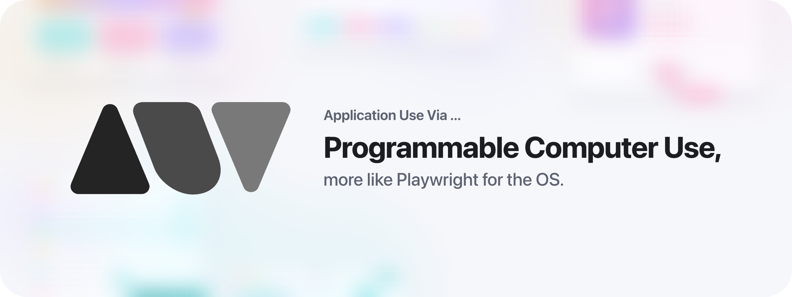
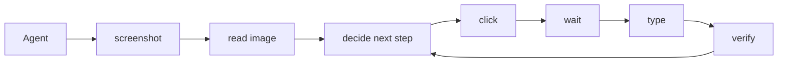
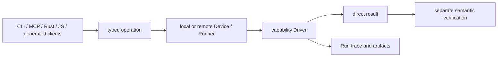

<p align="center">
  <picture>
    <source
      srcset="./docs/assets/readme-banner-dark.png"
      media="(prefers-color-scheme: dark)"
    />
    <source
      srcset="./docs/assets/readme-banner-light.png"
      media="(prefers-color-scheme: light), (prefers-color-scheme: no-preference)"
    />
    
  </picture>
</p>

<h1 align="center">AUV</h1>

[](LICENSE.md)

<p align="center">
  <a href="./README.md">English</a> | <b>简体中文</b>
</p>

AUV 意为 **Application Use Via ...**。

- Apple Music Application Use Via [`auv-apple-music`](https://github.com/moeru-ai/auv/tree/main/supported/apps/auv-apple-music)……
- macOS Media Control Use Via [`auv-media-macos`](https://github.com/moeru-ai/auv/tree/main/crates/auv-media-macos)……
- [Balatro](https://www.playbalatro.com/)（没错，就是那个游戏 [Balatro](https://www.playbalatro.com/)）Application Use Via [`auv-game-balatro`](https://github.com/moeru-ai/auv/tree/main/supported/games/auv-game-balatro)……
- …… 还有更多，等着你来实现。

> 把它理解成：可编程的 computer use，但不需要 agent。

<!-- START doctoc generated TOC please keep comment here to allow auto update -->
<!-- DON'T EDIT THIS SECTION, INSTEAD RE-RUN doctoc TO UPDATE -->
## 目录

- [快速开始](#快速开始)
- [理解 AUV](#理解-auv)
- [为什么要做 AUV？](#为什么要做-auv)
- [能力矩阵](#能力矩阵)
- [开发](#开发)
- [相关项目](#相关项目)
- [致谢](#致谢)
- [特别感谢](#特别感谢)
- [Star History](#star-history)
- [许可证](#许可证)

<!-- END doctoc generated TOC please keep comment here to allow auto update -->

## 快速开始

### 安装

安装预编译发行版：

#### macOS

```sh
brew install moeru-ai/tap/auv
auv --version
```

不使用 [Homebrew](https://brew.sh/) 时，也可以：

```sh
curl -fsSL https://auv.moeru.ai/install.sh | sh
```

#### Linux

```sh
curl -fsSL https://auv.moeru.ai/install.sh | sh
auv --version
```

> [!NOTE]
>
> 设置 `AUV_VERSION` 或 `AUV_INSTALL_DIR` 可以修改发行版本或安装目录（默认：`~/.local/bin`）。

#### Windows

##### Scoop

```powershell
scoop bucket add auv https://github.com/moeru-ai/auv
scoop install auv/auv
auv --version
```

##### 手动安装

下载对应架构的压缩包：

- [x86-64](https://github.com/moeru-ai/auv/releases/latest/download/auv-x86_64-pc-windows-msvc.zip)
- [ARM64](https://github.com/moeru-ai/auv/releases/latest/download/auv-aarch64-pc-windows-msvc.zip)

把压缩包解压到一个固定目录，然后把该目录加入用户 `PATH`。压缩包里只有一个 `auv.exe`；Windows helper 已内嵌其中。

### 用 proto 安装

先安装并配置 [proto](https://moonrepo.dev/docs/proto)。然后添加 AUV 插件并安装最新发行版：

```sh
proto plugin add auv "https://raw.githubusercontent.com/moeru-ai/auv/main/toolchain/proto/auv.toml" --to global
proto install auv latest --config-mode global --pin global
auv --version
```

> [!NOTE]
>
> macOS 的 `AUV Helper.app` 包含在 `proto` 安装中。在 Windows 上，`auv-helper.exe` 内嵌于 `auv.exe`，仅由需要提权的 helper 初始化命令释放出来。

> [!WARNING]
>
> 不支持 Linux musl。（但欢迎提 PR！）

### 用 Nix 安装

安装 [Nix](https://nixos.org/download/) 2.27 或更高版本，并启用 `nix-command` 与 `flakes` 实验性特性。在 macOS 上，先安装 Apple 的构建工具：

```sh
xcode-select --install
```

然后从本仓库安装默认的 AUV 包：

```sh
nix profile install 'git+https://github.com/moeru-ai/auv#default'
auv --version
```

必须使用 `git+https` 传输方式，Nix 才能拉取 AUV 的 Git 子模块。该 flake 定义了面向 Apple Silicon、Intel macOS，以及 x86-64、ARM64 Linux 的源码构建包。该包不支持 Windows 和 Linux musl。

Nix 包不包含已签名的 `AUV Helper.app`。在 macOS 上，如果你需要用官方 helper 运行 `auv setup macos-helper install`，请使用 Homebrew、proto 或直接下载发行版。

### 用 Cargo 安装

前置条件：[Rust](https://www.rust-lang.org/tools/install) 以及下面的平台构建工具。AUV 自带 Protobuf 源码，因此不需要 Buf。

> [!WARNING]
> `cargo install` 不包含 AUV Helper。如果你需要它，请使用上面的某种安装方式。

#### macOS

安装 Xcode Command Line Tools：

```sh
xcode-select --install
cargo install --git https://github.com/moeru-ai/auv auv-cli --bin auv
auv --version
```

#### Linux

在 Ubuntu 或 Debian 上，安装原生构建依赖：

```sh
sudo apt-get update
sudo apt-get install -y \
  pkg-config libclang-dev libxcb1-dev libxrandr-dev libdbus-1-dev \
  libpipewire-0.3-dev libwayland-dev libxkbcommon-dev libegl-dev \
  libleptonica-dev libtesseract-dev
cargo install --git https://github.com/moeru-ai/auv auv-cli --bin auv
auv --version
```

> [!NOTE]
> 其他 Linux 发行版的包名可能不同。

#### Windows

安装带 MSVC 工具链的 Rust、Visual Studio Build Tools 和 Windows SDK。

```powershell
cargo install --git https://github.com/moeru-ai/auv auv-cli --bin auv
auv --version
```

### 初始化

#### macOS

官方 macOS 发行版包含已签名的 `AUV Helper.app`。在 macOS 13 或更高版本上，为当前用户安装它：

```sh
auv setup macos-helper install
auv setup macos-helper status
```

> [!TIP]
> 该安装不需要 `sudo`，也不需要管理员密码。

如果 macOS 请求授权，打开「后台项目」与「辅助功能」设置：

```sh
auv setup macos-helper open-background-items-settings
auv setup macos-helper open-accessibility-settings
```

> [!NOTE]
> 集成 AUV 的项目可以给 `AUV Helper.app` 换品牌。它们可以修改它的名称、图标、bundle identifier 以及 Apple Developer 签名身份。打包选项见 [Shipped helper identity](crates/auv-device-helper-macos/README.md#shipped-helper-identity)。

把这些权限授予启动 AUV 的那个应用，通常是你的终端应用：

| 权限 | 用途 |
| --- | --- |
| 辅助功能 | 读取 AX 树、控制聚焦元素、键盘/指针自动化。 |
| 屏幕录制 | 截图、OCR、视觉检查与证据采集。 |
| 自动化 | AppleScript/System Events 的应用激活与前台回退路径。 |

修改权限后，重启终端。然后运行：

```sh
auv doctor
auv invoke app.probePermissions
```

#### Windows

> [!IMPORTANT]
> Windows 的初始化命令需要提权的 PowerShell。

```powershell
auv setup windows-helper install
auv setup windows-helper status
```

> [!NOTE]
> 该初始化命令会把内嵌在 `auv.exe` 里的 `auv-helper.exe` 释放到 `%ProgramFiles%\AUV`，然后把它注册为 LocalSystem 服务 `AuvHelper`。Helper 不监听网络。锁定与解锁通过一个以登录用户身份运行的普通 `auv serve` 完成。若要从网络接受配对的 Device，请用 `--listen http://0.0.0.0:9847` 启动那个 daemon。如果当前安装的是 0.0.28 的 Helper，请先运行 `auv setup windows-helper uninstall`，再重新安装并重新配对客户端。
>
> 证据等级：一个 Windows 11 主机上的一次已安装锁定与解锁门禁测试。这不是普遍支持声明。见 [Windows Helper 与 daemon 拆分](docs/ai/references/session-api/2026-10-06-windows-helper-daemon-split.md#evidence)。

### 卸载

按你的安装方式选择对应说明。如果安装了平台 Helper，请先移除它。

#### macOS

```sh
auv setup macos-helper uninstall
brew uninstall auv
```

> [!NOTE]
> 移除 Helper 会在登录钥匙串中保留注册数据，也会在 Application Support 目录中保留其他 AUV 数据。

#### Linux

```sh
rm "$HOME/.local/bin/auv"
```

#### Windows

在提权的 PowerShell 中运行这些命令：

```powershell
auv setup windows-helper uninstall
scoop uninstall auv
```

> [!NOTE]
> 移除 Helper 会在 `%ProgramData%` 中保留已注册的 PIN。daemon 自身的配对与策略数据留在它自己的存储中。

如果你是手动解压 ZIP 安装的，请从文件系统中删除该目录，再把它从 `PATH` 中移除。

#### Cargo

```sh
cargo uninstall auv-cli
```

## 理解 AUV

对于 [Cua](https://github.com/trycua/cua)、[`agent-browser`](https://github.com/vercel/agent-browser) 以及类似的 computer-use
项目来说，常见做法是按顺序执行 `screenshot`、`read image`、`click`、`type`、`wait`
以及后续的校验步骤，然后让 LLM 或 agent 判断下一步。



其中许多重复序列可以压成可复用的 GUI 操作。打开应用、等待就绪、填写表单、检查结果，
这些都应当能作为一条命令被调用，而不是每次都把同一套逐步循环再花一遍 token。

现代 agent 常用
[skills](https://developers.openai.com/api/docs/guides/tools-skills) 或项目说明来编排工具调用、CLI 和脚本。
但内置的 computer-use 接口，例如
[OpenAI Computer Use](https://developers.openai.com/api/docs/guides/tools-computer-use)
或 [Claude Computer Use](https://docs.anthropic.com/en/docs/agents-and-tools/computer-use)，
本质上仍是交互式的「模型与工具」循环，而不是可脚本化的 GUI 自动化库。

类似 [Playwright](https://playwright.dev/)，如果我们能把这些动作组织成可执行的、可复用的脚本，会怎样？

<table>
<thead><tr><th>工具调用循环</th><th>Rust 脚本</th></tr></thead>
<tbody>
<tr><td>

```text
• Ran screenshot
  └ saved screen.png
• Ran read image screen.png
  └ form is visible
• Ran click "Email"
  └ clicked
• Ran type "user@example.com"
  └ typed
• Ran screenshot
  └ saved after.png
• Ran verify form state
  └ ready
```

</td><td>

```rust
pub fn open_and_fill_form(
  app: &mut AppSession,
  data: FormData,
) -> AuvResult<OperationResult> {
  app.open()?;
  app.wait_for_ready()?;
  app.fill(data)?;
  app.verify_submitted()
}
```

</td></tr>
<tr><td>

```text
• Ran screenshot
  └ saved page-1.png
• Ran OCR visible rows
  └ 12 rows
• Ran scroll
  └ scrolled down
• Ran OCR visible rows
  └ 10 rows, 4 repeated
• Ran guess when to stop
  └ uncertain
```

</td><td>

```rust
pub fn scan_visible_rows(
  region: &mut WindowRegion,
) -> AuvResult<ScrollScanArtifact> {
  region.scan_rows_until_stop()
}
```

</td></tr>
<tr><td>

```text
• Ran click target
  └ clicked
• Ran screenshot
  └ saved after-click.png
• Ran semantic check
  └ mismatch
• Ran retry manually
  └ repeated tool loop
```

</td><td>

```rust
pub fn verify_and_retry<F>(
  mut operation: F,
) -> AuvResult<OperationResult>
where
  F: FnMut() -> AuvResult<OperationResult>,
{
  retry_until_verified(&mut operation)
}
```

</td></tr>
</tbody></table>

AUV 期望 agent 为端到端测试和快速应用操作去编写、测试并改进可复用的 GUI 自动化。

事实上，AUV 不是一个 computer-use agent。它不附带 agent 或 harness。
它提供工具、CLI、Driver 以及可验证、可观测的结果，让 agent 能够构建可复用的 GUI 操作。

AUV 的设计目标是与这类 coding agent 和 agent 产品配合使用：

- [Apeira](https://apeira.moeru.ai)
- [Codex](https://chatgpt.com/codex/)
- [Claude Code](https://claude.com/product/claude-code)
- [Pi Agent](https://github.com/earendil-works/pi)
- [LobeHub](https://github.com/lobehub/lobehub)
- [Kimi CLI](https://www.kimi.com/code)
- …… 也欢迎自带

这意味着：

- 只要你的 agent 能调用 CLI，AUV 就能当作 computer use 来用。
- 只要你的 agent 会写代码，AUV 就能把重复的 GUI 工作搬进可复用的 Rust 或 JavaScript/TypeScript 操作里。一旦某个 GUI 流程定型为操作，重复执行几乎可以做到零推理 token 成本。
- AUV 的 daemon 与扩展 API 使用带版本号的 Protobuf/gRPC 契约。任何具备兼容 Protobuf/gRPC 生成器的语言，都可以为这些契约生成客户端，而不需要 AUV 再发明一套语言专属协议。一方 SDK 的质量、打包与文档仍属于各自独立的支持声明：Rust 与 JavaScript/TypeScript 今天已经可用，一方 Python SDK 仍在计划中。

这些可复用的部分按职责拆分，但它们共用同一个执行模型，而不是变成互不相干的封装：



Driver 拥有平台能力，操作 crate 拥有可复用工作流，`auv-tracing` 拥有 Run 的证据与产物。
视觉 overlay 仍是独立的信任与调试面；画出一个光标永远不能代替输入投递或语义校验。
这种包结构让另一个前端或生成的客户端可以复用同一批操作，而不是围着 CLI 重新实现一遍。

## 为什么要做 AUV？

AUV 诞生于为 [Project AIRI](https://github.com/moeru-ai/airi) 构建通用游戏 agent 时积累的基础认知。自 2024 年起，我们尝试构建能让 LLM 玩下面这些游戏的 agent，实现方式可以在这些仓库里找到：

- [Balatro](https://github.com/proj-airi/game-playing-ai-balatro)
- [Kerbal Space Program](https://github.com/proj-airi/game-playing-ai-kerbal-space-program)
- [Factorio](https://github.com/moeru-ai/airi-factorio)
- [Dome Keeper](https://github.com/proj-airi/game-playing-ai-dome-keeper)

> 我们还实现了更多游戏，可以在 [Project AIRI](https://github.com/moeru-ai/airi) 组织里找到，但这四个需要 YOLO、OCR、屏幕理解和 computer-use 能力。
>
> 现在你有了可以为任何应用、任何游戏构建的框架。

自从 Vercel 发布 [`agent-browser`](https://github.com/vercel/agent-browser) 之后，我们爱上了它，并用它辅助 agent 构建了许多 Web 项目。但我们发现，让 agent 调用 `agent-browser` CLI 来执行命令所需的循环太慢、太低效。而在 computer use 的世界里，许多操作可以被重复成千上万次。就像 Playwright/Vitest 让我们能为应用编写端到端测试一样，为什么我们不把「写代码控制应用」这个思路扩展到 computer use 的世界里？

## 能力矩阵

> AUV 能做什么，以及与其他 computer-use 项目的对比。

- ✅：可以。
- ❌：不可以。
- ⚠️：部分支持。单元格内会说明限制。
- ⏳：计划中。
- —：未评估。

平台支持以 **原生桌面驱动** 一行为准。其他行只有在支持情况不同时才会点名平台。

| 能力 | AUV | [Cua](https://github.com/trycua/cua) | `@oai/sky`[^sky]<br>bundled | [OpenBridge](https://github.com/AFK-surf/OpenBridge)（[KWWK](https://github.com/EYHN/kwwk-computer-use-core) 内核） | Playwright |
| --- | --- | --- | --- | --- | --- |
| Agent 模式 | 💡 BYOA | 💡 BYOA | 💡 无 agent API | 💡 OpenBridge 内置 agent<br>KWWK 无 agent | 💡 BYOA + 内置 Test Agents |
| 语言无关 API | ✅ Protobuf/gRPC | ✅ HTTP/WebSocket | ❌ | ❌ | ❌ |
| 可脚本化（Rust） | ✅ | ✅ | ❌ | ❌ | ❌ |
| 可脚本化（TypeScript） | ✅ | ✅ | ✅ | ❌ | ✅ |
| 可脚本化（Python） | ⏳ 一方 SDK | ✅ | ❌ | ❌ | ✅ |
| 原生桌面驱动 | ✅ macOS/Linux/Windows<br>⏳ Android/iOS | ✅ macOS/Linux/Windows | ✅ macOS/Linux/Windows | ✅ macOS<br>❌ Linux/Windows | ❌ 仅浏览器 |
| CLI | ✅ | ✅ | ❌ | ❌ | ✅ |
| MCP | ✅ | ✅ | ❌ | ❌ | ✅ 浏览器 MCP |
| REPL / Codemode | ⏳ 计划中 | ❌ | ✅ Node REPL | ❌ | ❌ |
| 屏幕锁定/解锁 | ✅[^device-entry] | ❌ | ❌ | ❌ | ❌ |
| Trace | ✅ Run、产物、OpenTelemetry | ✅ 轨迹 | ❌ | ❌ | ✅ 测试 trace |
| 截图 | ✅ | ✅ | ✅ | ✅ | ✅ |
| OCR | ✅ macOS Vision/Linux Tesseract/Windows OCR | ⚠️ 需要外部模型 key | ❌ | ❌ | ❌ |
| 模板匹配 | ❌ 定位器<br>✅ 结果契约 | ❌ | ❌ | ❌ | ❌ |
| 无障碍树 | ✅ | ✅ | ✅ | ✅ | ✅ |
| 无障碍操作 | ⚠️ 聚焦与选择 | ✅ | ✅ | ✅ | ✅ |
| 鼠标点击 | ✅ | ✅ | ✅ | ✅ | ✅ |
| 鼠标移动 | ✅ | ✅ | ✅ Linux<br>❌ macOS/Windows | — | ✅ |
| 后台指针输入 | ✅ macOS<br>❌ Linux/Windows | ⚠️ 部分应用需要前台 | ✅ Linux 窗口目标<br>❌ macOS/Windows | ✅ | ✅ 浏览器上下文 |
| 前台指针输入 | ✅ | ✅ | ✅ | ✅ | ✅ |
| 键盘按住 | ✅ | ✅ | ✅ Linux 定时按住<br>❌ macOS/Windows | — | ✅ |
| 键盘输入 | ✅ | ✅ | ✅ | ✅ | ✅ |
| 滚动 | ✅ | ✅ | ✅ | ✅ | ✅ |
| Ghost Cursor | ✅ macOS：多个具名光标[^ghost-cursor]<br>❌ Linux/Windows | ⚠️ 单个 agent 光标 | ❌ | ❌ | ❌ |
| 可定制光标 | ✅ macOS：颜色、SVG、阴影<br>⚠️ Windows：仅颜色<br>❌ Linux | ❌ | ❌ | ❌ | ❌ |
| 滚动到列表 | ✅ 库与应用集成<br>❌ 通用 CLI | ❌ | ❌ | ❌ | ✅ 浏览器列表<br>❌ 桌面列表 |
| 反馈 | ✅ 尝试、回退、扰动、校验 | ✅ 输出与轨迹 | ⚠️ 动作后读取状态 | ⚠️ 仅元数据 | ⚠️ 断言与 trace |
| YOLO / 自定义模型 | ✅ | ✅ | ❌ | ❌ | ❌ |

- **滚动扫描（Scroll scan）** 是 AUV 存在的主要原因之一。大多数桌面自动化技术栈都能滚动并截图。
  它们不会产出页面记录、行候选、裁剪产物、OCR 片段，也不会给出明确的停止原因。当前的滚动扫描实现属于契约层的工作。
  等可复用 API 清晰之后，旧的 `scan window-region` CLI 会回归。
- **反馈（Feedback）** 是针对某个动作的机器可读证据。它记录输入路径、变化、产物、回退以及校验结果。
  这份证据告诉一次操作：什么时候该重试、该停止、还是该失败。

[^device-entry]: **证据等级：特定配置下的已安装主机测试。**
  该 API 锁定和解锁一个已存在的登录会话。它不会从已登出界面为用户登录。任何系统重启后，都需要先在 Device 上登录一次，
  并重新启动 `auv serve`（AUV 目前还不会把 daemon 安装成系统服务），之后才能远程锁定和解锁这个会话。2026-10-01 的测试跑了 300 次
  正常使用的锁定/解锁循环。该 API 首次尝试通过 298 次循环（99.33%）。
  请求的 OS 状态在 299 次循环中首次尝试即达成（99.67%）。
  全部 300 次循环都以 `USABLE` 状态结束。测试使用了 15、20、25、30 秒的停留时间。
  另有一项独立压力测试使用了接近零的延时。它测量的是 OS 转换就绪度，而不是正常使用下的可靠性。
  类型化契约、原生机制与配置限制见
  [Device 锁定契约与平台证据](docs/ai/references/session-api/2026-09-30-device-lock-contract-and-review.md)。
  原始日志保留在本地，不在持久化的证据包中。

[^ghost-cursor]: AUV 不定义数值形式的光标上限。实际数量受主机内存与
  WindowServer 资源限制。Ghost cursor 是视觉 overlay。它们不投递输入，也不证明动作结果。

[^sky]: **证据等级：已安装包的文档与 TypeScript
  声明。** 被检查的包是来自 ChatGPT 应用的 `@oai/sky` 0.7.1。它不在公共 npm registry 上提供。
  没有任何原生执行或原生二进制检查支持这一列。见
  [本地 Sky API 研究](docs/ai/references/driver/2026-09-18-held-input-project-research.md)
  以及
  [后台投递对比](docs/ai/references/driver/2026-09-23-background-delivery-project-comparison.md)。

## 开发

### `auv`

```sh
cargo fmt --check
cargo check
cargo test
```

更新 vendored 的 Protobuf 依赖，见
[Protobuf 源码分发参考](docs/ai/references/session-api/2026-09-08-protobuf-source-distribution-reference.md)。

### `@auv-js/sdk`

#### 前置条件

- [Node.js (LTS)](https://nodejs.org/)
- [pnpm](https://pnpm.io/installation)
- [Buf](https://buf.build/)

> [!NOTE]
>
> 如果你使用 proto，那么
>
> ```sh
> proto install buf
> proto install node
> proto install pnpm
> ```
>
> 应该能帮你装好必要的工具。

```sh
pnpm install
pnpm generate:proto
pnpm exec playwright install chromium
pnpm build
pnpm test:run
pnpm lint
pnpm typecheck
```

### 文档

当你修改根目录或各包 README 的标题后，运行 `pnpm docs:update`。
该命令会更新所有 README 的目录。

有用的入口：

```sh
auv doctor
auv invoke <command-id> --help
auv serve --help
auv devices list
auv runner --help
auv run --help
auv mcp serve
auv plugin list
```

共享词汇表见 `docs/TERMS_AND_CONCEPTS.md`。持久化的设计与证据笔记放在 `docs/ai/references/` 下。

## 相关项目

> [!NOTE]
>
> 本项目是 [Project AIRI](https://github.com/moeru-ai/airi) 生态的一部分。

## 致谢

- [MaaFramework](https://github.com/MaaXYZ/MaaFramework)
- [CUA](https://github.com/trycua/cua)
- [KWWKComputerUseCore](https://github.com/EYHN/kwwk-computer-use-core)
- [Playwright](https://github.com/microsoft/playwright)
- [WebDriver](https://developer.mozilla.org/en-US/docs/Web/WebDriver)
- [Appium](https://github.com/appium/appium-mac2-driver)
- [OpenBridge](https://github.com/AFK-surf/OpenBridge)

## 特别感谢

特别感谢所有为 auv 做出贡献的贡献者 ❤️

<a href="https://github.com/moeru-ai/auv/graphs/contributors">
  
</a>

## Star History

<a href="https://star-history.com/#moeru-ai/auv&Date">
  <picture>
    <source media="(prefers-color-scheme: dark)" srcset="https://api.star-history.com/svg?repos=moeru-ai/auv&type=Date&theme=dark" />
    <source media="(prefers-color-scheme: light)" srcset="https://api.star-history.com/svg?repos=moeru-ai/auv&type=Date" />
    
  </picture>
</a>

## 许可证

[Apache License 2.0](LICENSE.md)
