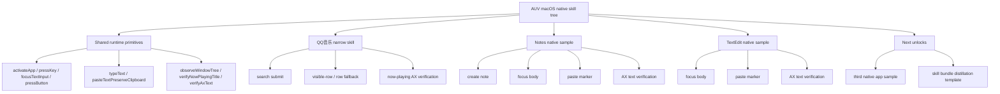

# AUV Native App Skill Tree

Date: 2026-05-17

Status: working skill tree

## Purpose

This tree tracks what has been proven on macOS native apps so far.

It is not the final distillation format. It is the current stepwise map for
what has actually been validated in the live runtime.

## Tree

## What Is Proven

- QQ音乐 has a validated narrow playback slice.
- `verifyNowPlayingTitle` is a stable AX-based contract.
- Notes has a validated native-app sample that uses `verifyAxText`.
- TextEdit has a validated native-app sample that uses the same contract.
- The same runtime can carry a second native app without screenshot OCR.
- The first bundle-shaped artifact is `bundles/native-app-skill-tree.v0.json`.

## What Is Not Proven

- generalized cross-app distillation
- browser reuse
- cloud reuse
- universal AX coverage across all native apps

## Evidence

- QQ音乐 narrow baseline: `docs/ai/references/2026-05-15-qqmusic-playback-verification.md`
- QQ音乐 narrow coverage: `docs/ai/references/2026-05-17-qqmusic-narrow-skill-coverage.md`
- QQ音乐 row fallback: `docs/ai/references/2026-05-16-qqmusic-row-fallback-case-matrix.md`
- Notes sample: `docs/ai/references/2026-05-17-notes-ax-text-sample.md`
- TextEdit sample: `recipes/macos/textedit/README.md`
- Distillation template: `docs/ai/references/2026-05-17-distillation-template-v0.md`
- Notes live replay: `run_1778947574511_68037_4`
- TextEdit live replay: `run_1778949229186_72054_3`
- QQ音乐 validated narrow skill commit: `42f3a18`
