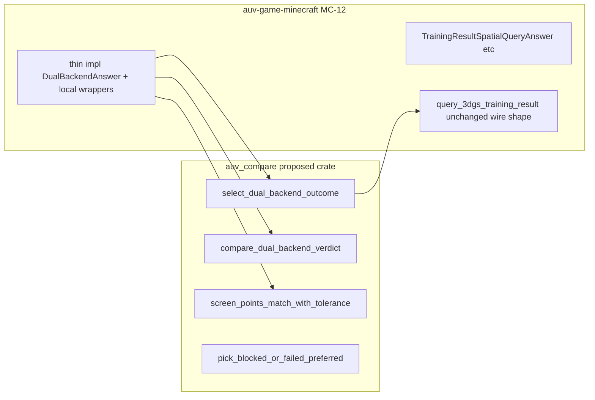

# 2026-06-27 AUV Core-B2 dual-backend query compare helper extraction

Date: 2026-06-27

Status: **design note only**. This note records a proposed narrow helper
extraction. It does **not** graduate any MC-10 through MC-17 donor contract
into core, and no implementation commit is implied by this document.

## Why this slice exists

MC-18 closed the current Minecraft spatial-result consumption chain. That
closure does **not** justify opening a large Core-B runtime, provider registry,
or shared spatial contract surface.

The owner explicitly approved **Core-B2 = helper-only extraction**, with priority
**#1** on dual-backend query compare policy. Like Core-A and Core-B1, this
slice is **prep / dedupe policy**, not contract graduation.

The honest donor picture today: only Minecraft MC-12
(`training_result_spatial_query.rs`) implements the four compare/selection
helpers. MC-15 and MC-18 reuse MC-12 behavior through that module, but no
second vertical independently owns the same policy yet. B2's value is **remove
glue duplication and freeze compare policy in a narrow helper crate**, not to
claim cross-vertical contract graduation.

## What would change

### Proposed new crate

- `crates/auv-compare`

Intentionally narrow scope: dual-backend answer selection, comparison verdict
branching, screen-point tolerance matching, and blocked/failed preference. The
crate does **not** own artifact IO, manifest wiring, provider registry, or
Minecraft-specific types.



### MC-12 thin adapters (design-level only)

The only allowed MC-12 touch surface at implement time:

- `crates/auv-game-minecraft/src/training_result_spatial_query.rs`: the four
  private functions become thin wrappers calling `auv-compare`
- `crates/auv-game-minecraft/src/lib.rs` and workspace `Cargo.toml`: add
  `auv-compare` dependency
- existing `training_result_spatial_query` integration tests: **behavior
  unchanged**, serving as regression net

MC-12 retains all wire shapes, manifest fields, inspect report layout, and
donor enum names (`TrainingResultSpatialQueryStatus`,
`TrainingResultSpatialQueryComparisonVerdict`,
`TrainingResultSpatialQueryBackend`). The shared crate exposes generic helper
names only.

## Why this helper is admissible now

This extraction satisfies the earlier-helper bar from Core-A D4 and the
admission table row for MC-12 compare policy:

| Source | Verdict |
| --- | --- |
| [`2026-06-27-auv-core-spatial-result-consumption-admission-table.md`](2026-06-27-auv-core-spatial-result-consumption-admission-table.md) L70 | `select_query_outcome`, `pick_blocked_or_failed_answer`, `compare_answers`, `answers_match` → **extract helper only** |
| Owner override | Core-B2 helper-only extraction approved; priority #1 = query compare |
| [`2026-06-27-auv-core-spatial-result-consumption-proof-matrix.md`](2026-06-27-auv-core-spatial-result-consumption-proof-matrix.md) L67 | `TrainingResultSpatialQueryComparisonVerdict` remains **candidate, not admissible yet** |

Helper extraction is admissible because:

- the policy may repeat across future dual-backend compare seams
- extraction removes glue without creating a new domain contract
- helper names are compare-policy names, not Minecraft donor names

It is **not** proof-matrix graduation for `TrainingResultSpatialQueryComparisonVerdict`.
That enum stays donor-local until a second vertical actually runs dual-backend
compare and needs the same five-label persisted evidence split.

Precedent: [`2026-06-27-auv-core-b1-json-file-helper-extraction.md`](2026-06-27-auv-core-b1-json-file-helper-extraction.md)
(new narrow crate + local thin adapters + no donor enum freeze).

## Proposed API and dependency direction

### Crate naming

- **Proposed name**: `crates/auv-compare` (parallel to `auv-file`)
- **NOTICE**: the crate owns dual-backend compare policy only. Names like
  `auv-spatial-runtime` are out of scope.

### Proposed public API (generic, no Minecraft symbols)

| Function / type | Responsibility |
| --- | --- |
| `DualBackendStageStatus` | Helper-internal triad: `Answered / Blocked / Failed`. **Not** a move of `TrainingResultSpatialQueryStatus`. |
| `DualBackendCompareVerdict` | Helper-internal five-label verdict: `Match / Divergent / ProviderOnly / ReferenceOnly / NotComparable`. MC-12 maps to `TrainingResultSpatialQueryComparisonVerdict`. |
| `DualBackendAnswer` trait | `stage_status()`, optional `visibility_key()`, `screen_point()`, `match_radius_px()` |
| `compare_dual_backend_verdict(...)` | Pure compare branch (maps to current `compare_answers`) |
| `select_dual_backend_outcome(...)` | Selection + compare; backend side chosen via callback or generic side tag. **Does not** introduce `TrainingResultSpatialQueryBackend`. |
| `screen_points_match_with_tolerance(...)` | Geometry helper extracted from `answers_match` |
| `pick_blocked_or_failed_preferred(...)` | Blocked before first candidate (maps to `pick_blocked_or_failed_answer`) |

### Dependency direction

```text
auv-compare  ←  auv-game-minecraft (MC-12 adapter only)
```

One-way only. `auv-compare` must not depend on `auv-game-minecraft` or any
Minecraft-specific types. Reverse dependency is forbidden.

## Behavior preserved on purpose

The following MC-12 frozen policies in
[`crates/auv-game-minecraft/src/training_result_spatial_query.rs`](../../crates/auv-game-minecraft/src/training_result_spatial_query.rs)
(L534–656) are the acceptance anchors. Implement must preserve them exactly.

### 1. Selection (`select_query_outcome`)

Priority order:

1. provider `answered` → use provider answer; backend =
   `configured_provider_backend` or `CommandProvider`
2. else reference `answered` → use reference answer; backend =
   `ProjectionReference`
3. else → `pick_blocked_or_failed_answer`; backend = `None`

Comparison verdict is computed in all three branches via `compare_answers`.

### 2. Compare verdict (`compare_answers`)

Five-label split on `(provider_answered, reference_answered)`:

| Provider answered | Reference answered | Verdict |
| --- | --- | --- |
| yes | yes | `Match` if `answers_match`, else `Divergent` |
| yes | no | `ProviderOnly` |
| no | yes | `ReferenceOnly` |
| no | no | `NotComparable` |

### 3. Match rules (`answers_match`)

- `visibility` must be equal; mismatch → not a match
- both `screen_point` `Some`: Euclidean distance ≤
  `max(provider.match_radius_px.unwrap_or(1.0), reference.match_radius_px.unwrap_or(1.0))`
- both `screen_point` `None`: match
- one `None`, one `Some`: divergent (not a match)

### 4. Blocked/failed preference (`pick_blocked_or_failed_answer`)

Among provider and reference candidates (flattened in order):

1. first `Blocked` status wins
2. else first candidate in order
3. else synthetic `Failed` answer with
   `TargetBlockAbsentFromScenePacket` reason and
   `"MC-12 spatial query produced no backend answer"` message

### Known quirk (implement phase only)

`compare_answers` accepts `provider_configured: bool` but currently ignores it
(`let _ = provider_configured;`). The implement slice may delete the unused
parameter or add a test documenting intentional non-use. **Do not** change
compare behavior because of this parameter during B2.

## Deliberate non-goals

This slice intentionally does **not**:

- graduate `TrainingResultSpatialQueryComparisonVerdict` or
  `TrainingResultSpatialQueryStatus` into core as shared contract enums
- extract provider trait, registry, blackboard, arbiter, or action lease
- change MC-12 manifest / inspect wire shape, MC-13 pairing, or MC-14 readiness
- invent a fake second vertical consumer to justify contract graduation
- start a giant generic spatial runtime trait (see Core-B guard in
  [`2026-06-27-auv-core-spatial-result-consumption-pattern.md`](2026-06-27-auv-core-spatial-result-consumption-pattern.md)
  L469–478)

Deferred follow-ups (not in B2 scope):

- **#2** business-key pairing helper (`inspect.rs` manifest/report pairing) —
  open B2b only when repetition evidence exists
- **#3** shared status label render helper — do not freeze donor enums early

Those remain blocked by the Core-A proof matrix, same as Core-B1 deliberate
non-goals for enum and contract extraction.

## Validation plan (implement phase)

When implementation lands, validate with:

- `cargo fmt --check`
- `cargo check -p auv-compare -p auv-game-minecraft`
- `cargo test -p auv-compare`
- `cargo test -p auv-game-minecraft training_result_spatial_query`
- `git diff --check`

New `auv-compare` unit tests should cover the four policy branches directly.
MC-12 integration tests remain the regression net for donor wording, wire
shapes, and end-to-end query behavior.

## Honest conclusion

Core-B2 is a **shared compare policy helper extraction**, nothing more, and
explicitly **not** a contract graduation.

`TrainingResultSpatialQueryComparisonVerdict` stays a **candidate** in the
proof matrix until a second vertical independently needs the same five-label
dual-backend evidence split. Until then, `auv-compare` is honest prep: one
donor today, generic helper names, MC-12 keeps all artifact semantics local.
