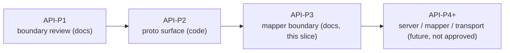
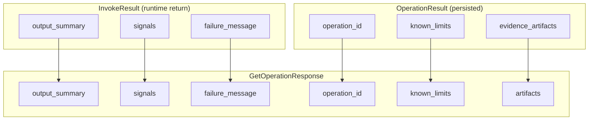

# 2026-06-30 AUV API-P3: Session proto mapper boundary and server handoff

Date: 2026-06-30

Status: **docs-only handoff** — defines the mapping boundary between the
API-P2 `auv.api.session.v1` proto surface and AUV's existing internal result
types, and records the open decisions a future server slice must resolve. It
does **not** approve or implement a gRPC server, a transport runtime, or any
proto-to-domain mapper code.

## One-line summary

API-P2 landed the minimal `SessionService` proto surface. API-P3 freezes how
that external surface relates to the internal producer types
(`auv_cli_invoke::InvokeResult`, `auv_cli_invoke::InvokeRequest`,
`crate::contract::OperationResult`, trace artifact records) so that whoever
writes the server mapper later does not silently invent a third result schema
or misread which internal field feeds which proto field.

## Where API-P3 sits



- **API-P1**: declared proto an external summary boundary, listed the minimal
  message set, froze non-goals.
  [`2026-06-30-auv-api-p1-session-proto-boundary-review.md`](2026-06-30-auv-api-p1-session-proto-boundary-review.md)
- **API-P2**: replaced `DoExample*` with `CreateSession` / `Invoke` /
  `GetOperation` / `StreamSessionEvents` plus refs, comments, and round-trip
  tests (commit `758fa21`).
- **API-P3 (this slice)**: docs-only mapping + handoff. No code.

## Current surfaces under review

### Proto (external, landed in API-P2)

`proto/auv/api/v1/session.proto`, package `auv.api.session.v1`:

- `SessionRef { session_id }`
- `OperationRef { run_id, operation_id }`
- `ArtifactRef { run_id, artifact_id, role }`
- `InvokeRequest { session, command_id, json_payload (bytes) }`
- `InvokeResponse { operation, status, artifacts, known_limits, failure_message }`
- `GetOperationResponse { operation, status, output_summary, signals (map), artifacts, failure_message, known_limits }`
- `SessionEvent { event_type, session, operation, artifact, summary }`

### Internal producers (source of truth, unchanged)

`auv_cli_invoke::InvokeRequest` (`crates/auv-cli-invoke/src/model.rs`):

- `command_id: String`
- `target: ExecutionTarget { application_id: Option<String>, target_label: Option<String> }`
- `inputs: BTreeMap<String, String>`
- `dry_run: bool`

`auv_cli_invoke::InvokeResult` (`crates/auv-cli-invoke/src/model.rs`):

- `run_id: String`
- `producer_span_id: SpanId`
- `status: RunStatus` (`Completed` | `Failed`)
- `output_summary: String`
- `signals: BTreeMap<String, String>`
- `artifacts: Vec<ArtifactRecordV1Alpha1>`
- `artifact_paths: Vec<PathBuf>`
- `failure_message: Option<String>`

`crate::contract::OperationResult` (`src/contract.rs`):

- `api_version: String`
- `run_id: RunId`
- `status: OperationStatus` (`Completed` | `Failed`)
- `operation_id: String`
- `evidence_artifacts: Vec<ArtifactRef>` (the `auv_tracing_driver::ArtifactRef`)
- `output: OperationOutput` (`Candidates` | `Verification` | `Acknowledged`)
- `verifications: Vec<VerificationResult>`
- `freshness_basis: Option<FreshnessBasis>`
- `known_limits: Vec<String>`

Artifact shapes:

- `ArtifactRecordV1Alpha1` (`crates/auv-tracing-driver/src/trace.rs`):
  `artifact_id`, `span_id`, `event_id`, `role`, `mime_type`, `path`, `sha256`,
  `attributes`, `summary` — **no `run_id`** (the run is implied by the owning
  record).
- `auv_tracing_driver::ArtifactRef` (`crates/auv-tracing-driver/src/artifact.rs`):
  `run_id`, `artifact_id`, `span_id`, `captured_event_id` — **no `role`**.

## Field mapping tables

### `InvokeRequest` (proto, inbound) -> host `InvokeRequest`

| Proto field | Internal target | Mapping rule |
| --- | --- | --- |
| `session.session_id` | run `session_id` (runtime) | reference; runtime still owns `default` session policy |
| `command_id` | `InvokeRequest.command_id` | direct |
| `json_payload` (bytes) | `target` + `inputs` + `dry_run` | **decode required**; envelope schema undefined (see open decision 5) |

### `InvokeResponse` (proto, outbound) <- internal

| Proto field | Internal source | Mapping rule |
| --- | --- | --- |
| `operation.run_id` | `InvokeResult.run_id` | direct |
| `operation.operation_id` | see open decision 2 | unresolved (`command_id` vs persisted `OperationResult.operation_id`) |
| `status` | `InvokeResult.status` / `RunStatus` | `Completed`->"completed", `Failed`->"failed" |
| `artifacts[]` | `InvokeResult.artifacts` (`ArtifactRecordV1Alpha1`) | join `run_id` from `InvokeResult.run_id` + `role`/`artifact_id` from record |
| `known_limits[]` | **not on `InvokeResult`** | only on `OperationResult.known_limits`; requires reading persisted record (see open decision 1) |
| `failure_message` | `InvokeResult.failure_message` | `None` -> empty string |

### `GetOperationResponse` (proto, outbound) <- internal

| Proto field | Internal source | Mapping rule |
| --- | --- | --- |
| `operation.run_id` | `OperationResult.run_id` | direct |
| `operation.operation_id` | `OperationResult.operation_id` | direct, but **domain label** (e.g. `music.search.results`), not `command_id` (open decision 2) |
| `status` | `OperationResult.status` | `Completed`/`Failed` -> string |
| `output_summary` | **not on `OperationResult`** | comes from `InvokeResult.output_summary`; not persisted in `OperationResult` (open decision 1) |
| `signals` (map) | **not on `OperationResult`** | comes from `InvokeResult.signals`; not persisted in `OperationResult` (open decision 1) |
| `artifacts[]` | `OperationResult.evidence_artifacts` (`ArtifactRef`, no `role`) | `role` is absent on internal `ArtifactRef`; needs role from elsewhere (open decision 4) |
| `failure_message` | **not on `OperationResult`** | from `InvokeResult.failure_message` (open decision 1) |
| `known_limits[]` | `OperationResult.known_limits` | direct |

## The core finding: `GetOperationResponse` is a two-source projection

No single internal type maps 1:1 to `GetOperationResponse`. It mixes fields
that only exist on the **runtime return value** (`InvokeResult`:
`output_summary`, `signals`, `failure_message`) with fields that only exist on
the **persisted record** (`OperationResult`: `operation_id`, `known_limits`).



Implication for the server slice: a faithful `GetOperation` cannot be served
from the persisted `OperationResult` artifact alone. Either (a) the server also
retains the transient `InvokeResult` summary fields, or (b) `output_summary` /
`signals` / `failure_message` become persisted alongside the operation record.
This is an explicit open decision, not something to silently improvise inside a
mapper.

## Open decisions for the future server slice

These are deliberately unresolved in API-P3. Each needs an owner-named call
before any mapper code is written.

1. **Two-source projection for `GetOperation`.** `output_summary`, `signals`,
   and `failure_message` live on `InvokeResult` only; `known_limits` and the
   real `operation_id` live on `OperationResult` only. Decide whether the
   server keeps `InvokeResult` summary state addressable after invoke, or
   whether those summary fields get persisted. Until then, a `GetOperation`
   served purely from disk would return empty `output_summary` / `signals`.

2. **`operation_id` semantics.** API-P2 field comment says v1 maps
   `operation_id` to `InvokeRequest.command_id`. But `InvokeResult` has no
   `operation_id` and no `command_id`, and `OperationResult.operation_id` is a
   **domain label** (e.g. `music.search.results`) that is not the command id.
   The `Invoke` path (command_id known from the request) and the
   `GetOperation` path (only the persisted domain `operation_id` known) would
   therefore disagree. Decide one rule: either both expose `command_id`, or
   both expose the persisted domain `operation_id`, or `OperationRef` carries
   both. Do not let `Invoke` and `GetOperation` emit different `operation_id`
   meanings for the same run.

3. **`status` is execution status, not verification verdict.** Proto `status`
   is two-state (`completed` | `failed`) and reflects whether the command
   dispatched/finished, mirroring `RunStatus` / `OperationStatus`. It does
   **not** carry semantic verification outcome (`passed` / `failed` /
   `absent` / `unreliable`) which lives in `VerificationResult` +
   `FailureLayer`. A future slice that wants to expose verification verdicts
   must add a distinct field/message; it must not overload `status`.

4. **`ArtifactRef.role` source.** Proto `ArtifactRef` needs `{ run_id,
   artifact_id, role }`. Internal `auv_tracing_driver::ArtifactRef` has
   `run_id` + `artifact_id` but **no `role`**; `ArtifactRecordV1Alpha1` has
   `artifact_id` + `role` but **no `run_id`**. The mapper must join: `run_id`
   from the owning result, `role` from the artifact record. Proto intentionally
   drops `span_id`, `mime_type`, `path`, `sha256`, `attributes`, `summary`
   (reference-only per API-P1).

5. **`json_payload` envelope schema.** Proto `InvokeRequest.json_payload` is
   opaque `bytes` (documented as UTF-8 JSON object when non-empty). The host
   `InvokeRequest` needs `target { application_id, target_label }`, `inputs`
   (string map), and `dry_run`. A future slice must define and version the JSON
   envelope that decodes into those fields. API-P3 does **not** standardize it;
   a sketch is recorded below for the next author, not as an approved schema.

6. **`StreamSessionEvents` has no internal producer yet.** There is no existing
   session-scoped event stream in the runtime. Trace records carry span-level
   events, but nothing emits `SessionEvent`-shaped lifecycle events
   (`session_created`, `invoke_started`, `invoke_completed`, `invoke_failed`,
   `artifact_recorded`). A future slice must build that projection from run /
   trace lifecycle; there is no 1:1 source to map today.

7. **`CreateSession` has no explicit internal entry.** Sessions are currently
   an implicit runtime concern (`session_id` defaults inside the runtime, see
   `docs/TERMS_AND_CONCEPTS.md`). There is no public "create session" API. A
   future slice must decide whether `CreateSession` allocates a real session
   handle or simply echoes a caller-provided / runtime-default `session_id`.

8. **`verifications` and `OperationOutput` do not project to proto v1.**
   `OperationResult.output` (`Candidates` / `Verification` / `Acknowledged`)
   and `OperationResult.verifications` are not represented in the proto surface;
   `GetOperationResponse` only carries `output_summary` text plus `ArtifactRef`
   pointers. Semantic evidence is intended to be read via artifacts + the
   inspect surface, not inlined into proto (consistent with API-P1
   reference-only boundary). Recorded here so a later author does not treat the
   absence as an oversight.

## Non-approved sketch: `json_payload` envelope (for the next author only)

Recorded so open decision 5 has a concrete starting point. **Not approved, not
implemented, not a contract.**

```json
{
  "target": { "application_id": "com.mojang.minecraft", "target_label": null },
  "inputs": { "title": "Minecraft", "offset_x": "0.5", "offset_y": "0.5" },
  "dry_run": false
}
```

A real slice would version this (e.g. an envelope `api_version`), define error
behavior for malformed payloads, and decide size limits at the transport layer.

## Handoff checklist for a future server / mapper slice

When (and only when) an owner approves server work, that slice should:

- [ ] Resolve open decisions 1, 2, 5, 6, 7 before writing mapper code.
- [ ] Implement `proto <-> host` mappers in a dedicated module, not inline in
      RPC handlers, so the two-source projection is testable in isolation.
- [ ] Reuse `RunStatus` / `OperationStatus` for the status string mapping;
      do not introduce a third status enum.
- [ ] Treat `InvokeResult` and `OperationResult` as source of truth; the proto
      types stay summary/reference-only (API-P1 boundary).
- [ ] Add round-trip and mapper unit tests that assert each proto field's
      internal source, especially the `GetOperation` two-source join.
- [ ] Keep `verifications` / semantic verdicts out of `status`; expose them, if
      ever, through a separate explicit field with its own owner-named slice.

## Explicit non-goals (API-P3)

API-P3 does **not**:

- implement or approve a gRPC server, daemon, or transport runtime
- write any proto-to-domain or domain-to-proto mapper code
- modify `session.proto`, `crates/auv-api-proto`, or any Rust source
- persist new fields onto `OperationResult` or `InvokeResult`
- change `docs/TERMS_AND_CONCEPTS.md` vocabulary
- standardize the `json_payload` JSON envelope
- add `SessionEvent` producers or a session registry

Any of the above needs a new owner-named scope.

## Validation for this slice

Docs-only:

- `git diff --check`

## Related

- API-P1 boundary review:
  [`2026-06-30-auv-api-p1-session-proto-boundary-review.md`](2026-06-30-auv-api-p1-session-proto-boundary-review.md)
- Proto surface: `proto/auv/api/v1/session.proto` (API-P2, commit `758fa21`)
- Proto crate + tests: `crates/auv-api-proto/src/lib.rs`
- Invoke host types: `crates/auv-cli-invoke/src/model.rs`
- Persisted result contract: `src/contract.rs`
  (`OperationResult`, `OperationStatus`, `OperationOutput`,
  `VerificationResult`)
- Artifact records: `crates/auv-tracing-driver/src/trace.rs`,
  `crates/auv-tracing-driver/src/artifact.rs`
- Shared vocabulary: `docs/TERMS_AND_CONCEPTS.md`
