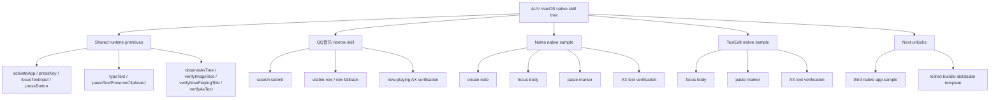

# AUV Native App Skill Tree

Date: 2026-05-17

Status: historical phase 1 frozen tree; bundle execution was retired on
2026-06-11

## Purpose

This tree tracks what has been proven on macOS native apps so far.

It is not the final distillation format. It is the current stepwise map for
what has actually been validated in the live runtime.

As of 2026-05-18, this tree is frozen for phase 1. That means the narrow-skill
product slice is considered good enough to stop reopening the same exploration
loop, while unresolved boundaries remain explicit instead of being hand-waved
away.

## Tree

## What Is Proven

- QQ音乐 has a validated narrow playback slice.
- The native-app bundle now carries two separate QQ音乐 members:
  - OCR-anchor playback with captured-image verification
  - row-fallback playback with AX now-playing verification
- The exported bundle/package now carries structured strategy truth instead of
  forcing downstream consumers to infer it from recipe prose.
- The exported bundle/package now also carries a normalized `taxonomyId` for
  each member strategy, so downstream consumers can group narrow skills by
  generic contract shape without reparsing prose.
- `verifyImageText` is the current evidence-image verification contract for the
  OCR-anchor playback slice.
- `verifyNowPlayingTitle` is the stable AX-based contract for the row-fallback
  playback slice.
- Notes has a validated native-app sample that uses `verifyAxText`.
- TextEdit has a validated native-app sample that uses the same contract.
- The same runtime can carry a second native app without screenshot OCR.
- The first bundle-shaped artifact was the historical `native-app-skill-tree`
  manifest; that bundle surface was retired on 2026-06-11.

## What Is Not Proven

- generalized cross-app distillation
- browser reuse
- cloud reuse
- universal AX coverage across all native apps
- QQ音乐 Chinese requested-title semantic selection through row fallback
- NetEaseMusic fixed-layout playback as a promoted native-app bundle member

## Phase 1 Freeze Decision

Phase 1 is frozen with the following interpretation:

- keep the validated sample set narrow
- keep the current runtime / recipe / case-matrix / bundle / package flow as
  the source of truth
- accept the remaining QQ音乐 Chinese semantic-selection gap as an explicit
  boundary
- do not reopen the same OCR-chasing loop and pretend it is phase-1 work

This is a freeze of scope, not a claim that every QQ音乐 edge case is solved.

## Post-Freeze Note

After the freeze, the repo gained a local NetEaseMusic fixed-layout playback
baseline under `recipes/macos/netease-cloud-music/`.

That baseline is real, but it is not part of the frozen phase-1 skill tree.
It currently belongs to the V2 lane as a useful local sample that still needs
workflow-backed promotion truth instead of being stuffed directly into the
bundle.

## Evidence

- QQ音乐 narrow baseline: `docs/ai/references/apps/qqmusic/2026-05-15-qqmusic-playback-verification.md`
- QQ音乐 narrow coverage: `docs/ai/references/apps/qqmusic/2026-05-17-qqmusic-narrow-skill-coverage.md`
- QQ音乐 row fallback: `docs/ai/references/apps/qqmusic/2026-05-16-qqmusic-row-fallback-case-matrix.md`
- QQ音乐 narrow coverage: `docs/ai/references/apps/qqmusic/2026-05-17-qqmusic-narrow-skill-coverage.md`
- Phase 1 freeze note: `docs/ai/references/archive/phase-history/2026-05-18-phase-1-freeze.md`
- Phase 2 / V2 contract: `docs/ai/references/ops/2026-05-19-v2-docs-contract.md`
- Notes sample: `docs/ai/references/archive/ax-copilot/2026-05-17-notes-ax-text-sample.md`
- TextEdit sample: `recipes/macos/textedit/README.md`
- NetEaseMusic fixed-layout baseline: `docs/ai/references/apps/netease-music/2026-05-19-netease-cloud-music-fixed-layout-baseline.md`
- Distillation template: `docs/ai/references/ops/2026-05-17-distillation-template-v0.md`
- Notes live replay: `run_1778947574511_68037_4`
- TextEdit live replay: `run_1778949229186_72054_3`
- QQ音乐 validated narrow skill commit: `42f3a18`
