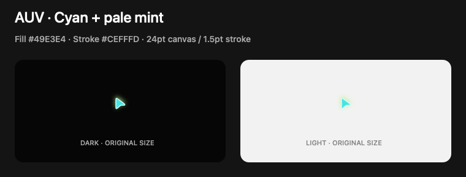

# Overlay host themes and native cursor shadows

Hosts can override overlay appearance without rebuilding a native adapter.
The macOS built-in AUV cursor also uses compact, rounded vector artwork and a
pale-green native shadow by default. This slice changes presentation, not input
delivery, targeting, geometry, animation, or which commands produce overlays.

## Default macOS cursor

The AUV and AUV-click built-ins use the shared assets in
`crates/auv-driver-overlay-common/assets/`. Both retain a 24-point canvas and a
1.5-point border. The normal cursor has cyan fill (`#49e3e4`) and near-white mint
stroke (`#cefffd`); the click variant brightens its fill to `#92eeef`.

`Shadow::auv()` supplies pale green RGBA `(0.72, 0.94, 0.52, 0.8)`, an 8-point
blur radius, and a 2-point downward offset. The user cursor retains its previous
artwork. Windows retains its existing built-in renderer; the new vector artwork
and native shadow are currently a macOS capability.

The preview below shows the implemented cyan palette using real AppKit shadow
rendering at 1:1 on dark and light backgrounds.



## Contract and precedence

- `auv-driver-overlay-common::OverlayTheme` owns partial typed overrides and
  pure `apply(&Overlay)` composition.
- `auv-driver-overlay::show` reads JSON from `AUV_OVERLAY_THEME` in the
  **rendering process**, applies it to the layers, then selects the native adapter.
- `show_with_theme` uses an explicit typed theme and never reads the environment.
  An empty theme preserves supplied layer styles, including built-in defaults.
- Configured theme fields override layer styles, including explicit CLI colors.
  Unset fields preserve the supplied layer values. Geometry, labels, visibility,
  and timing are not changed.
- The macOS adapter supplies its default shadow only for built-in AUV artwork
  when there is no explicit shadow. Custom SVGs do not inherit that default.
  A transparent explicit shadow suppresses the built-in glow.

The facade is already used by macOS/Windows session overlay APIs. These overrides
therefore reach direct overlay requests and composed `CaptureFrame` / `ClickTarget`
layers wherever the existing execution path presents them. They do not add
presentation to selected Runner capture/input paths that currently omit overlays.
Calling a native adapter directly bypasses facade environment configuration.

## Host configuration

The Node SDK already forwards `startAuv({ environment })` to its daemon process;
first-party Runner children inherit that environment. Launch an updated AUV
binary containing this feature.

```ts
import { startAuv } from '@auv-js/sdk/node';

const daemon = await startAuv({
  environment: {
    AUV_OVERLAY_THEME: JSON.stringify({
      outline_color: '#336699',
      cursor_label_background: '#336699',
      cursor_label_foreground: '#ffffff',
      status_background: '#202020ee',
      status_foreground: '#ffffff',
      cursor_image: {
        kind: 'svg',
        source: '<svg xmlns="http://www.w3.org/2000/svg" width="24" height="24" viewBox="0 0 24 24"><path fill="#c9c9c9" stroke="#eeeeee" stroke-width="1.5" stroke-linejoin="round" d="M3 3v18l7-7h8Z"/></svg>',
      },
      cursor_shadow: {
        color: { red: 1, green: 0.6, blue: 0.15, alpha: 0.85 },
        blur_radius: 8,
        offset_x: 0,
        offset_y: 2,
      },
    }),
  },
});
```

Pass resolved colors, not CSS variables or palette names. Top-level theme colors
accept `#RRGGBB`, `#RRGGBBAA` (also without `#`), or the existing normalized RGBA
object. Serialization uses RGBA. Nested `cursor_shadow.color` uses RGBA objects.

Unknown fields, malformed JSON, invalid color channels, non-finite shadow offsets,
negative/non-finite blur radii, and empty/oversized SVG are rejected. SVG retains
the existing 256 KiB CLI bound; native decoding owns SVG format validation.
A missing environment variable means no host override; an empty string is an
error; `{}` is an empty theme.

Set the variable on `auv serve` / `startAuv`, not just a CLI connecting to an
already-running daemon. Updating a parent environment cannot update an existing
Runner. Restart owned processes to change environment defaults; the facade has
no global mutable cache. `AUV_CONTEXT` remains a routing/reference contract.

For local Rust embedding, `show_with_theme` allows per-call changes without
process-global mutation. Remote Rust callers can apply a theme before sending
existing layers, but rendering-host environment overrides still apply last.
`CursorStyle.shadow` is also carried by the additive protobuf `Shadow` message;
use updated remote binaries to verify that field's behavior.

A session-owned remote live-update API is deferred until a host needs theme
switching without restarting its Runner. Do not mutate a running daemon's
process environment as an update API.

## Native rendering

Swift/AppKit `NSShadow` composites the sprite once into a transparency group and
blurs its combined alpha mask. Label pills and click ripples are drawn outside
that graphics-state scope. The renderer contains no host-specific palette.
See [Apple's NSShadow documentation](https://developer.apple.com/documentation/appkit/nsshadow).

Shadow dimensions are logical points, independent of SVG scaling. Positive offsets
move right/down. The view reserves three blur radii plus the largest absolute
offset on each side; window positioning cancels that inset. This preserves sprite
size and target position while keeping the shadow inside the transparent window.
The window's generic `hasShadow` remains off.

Use a clean SVG with a 24-point canvas and `--sprite-size 24` for 1:1 rendering.
Remove any SVG glow layers to avoid stacking native blur on a baked-in effect.

Windows explicitly rejects requested SVG cursor art and native cursor shadows.
The single `cursor_image` theme override replaces all cursor-layer artwork; omit
it to preserve distinct built-in identities. Variant-specific host artwork is
intentionally deferred until a host needs multiple simultaneous cursor identities.

## Verification

- Common/facade tests cover partial themes, unchanged geometry and visibility,
  typed/hex colors, SVG bounds, invalid shadow values, and serialization.
- macOS adapter tests cover default artwork/shadow selection, unchanged 24-point
  sizing, transparent shadow overrides, and custom/user cursor isolation.
- Client and Runner tests cover shadow protobuf serialization and validation.
- `native/swift/Tests/CursorShadowProbe/main.swift` is a standalone AppKit probe.
  Compile it with `Sources/AuvMacosOverlayNative/CursorShadow.swift`. It verifies
  the actual SVG's orange halo outside the source mask, no clipped visible edge,
  and graphics-state restoration before subsequent drawing.
- Swift bridge and protobuf generation, the native SwiftPM build, `cargo check`,
  formatting, and focused tests are recorded in the PR validation summary.

Known local baseline checks: SDK type checking reports three `AbortSignal.any`
type errors in unchanged files. Strict native-crate Clippy reports
`too_many_arguments` for four flat functions generated by `swift_bridge::bridge`;
the original FFI signatures already exceeded the seven-argument limit. With only
that generated-code lint allowed, targeted native-crate Clippy passes. No source
lint suppression was added.

Validation for this delivery: `cargo test` passed 69 CLI/default-member tests;
focused common/facade/macOS overlay suites passed 23 tests. `cargo check`, native
SwiftPM build, formatting, and scoped overlay protobuf lint passed. Whole-schema
Buf lint reports an existing response-type naming issue in unchanged `input.proto`.

Evidence levels: unit tests and local macOS drawing/live-invoke probes. No Windows
runtime verification or cross-platform native-shadow support is claimed.
