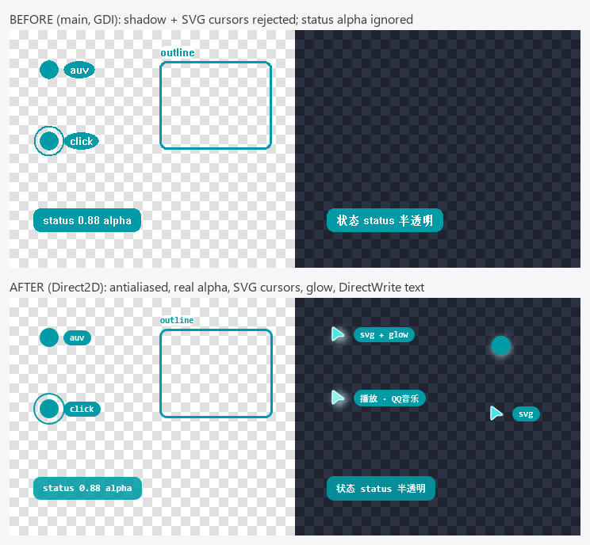
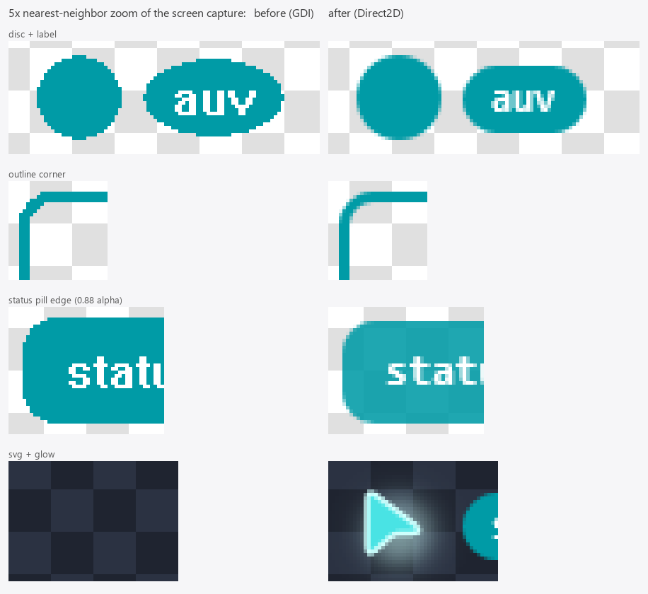

# Windows overlay renderer on Direct2D: evidence

Issue: [moeru-ai/auv#167](https://github.com/moeru-ai/auv/issues/167).
Owner decisions (2026-10-09): go straight to Direct2D with no tiny-skia renderer
slice; rasterize SVG cursor art with resvg into a bitmap that Direct2D draws.

## What changed

`auv-driver-overlay-windows` keeps its window and its presentation path: one
topmost, click-through layered window per process, a virtual-screen-sized 32-bit DIB
section per frame, and `UpdateLayeredWindow(ULW_ALPHA)`. Only the drawing layer
changed.

| Before (GDI) | After |
|---|---|
| `Ellipse`, `RoundRect` with solid pens/brushes, aliased | `ID2D1DCRenderTarget` bound to the DIB's DC: `FillEllipse`, `DrawEllipse`, `FillRoundedRectangle`, `DrawRoundedRectangle`, antialiased |
| Alpha faked with a sentinel color: drawn pixels opaque, everything else transparent | Direct2D writes premultiplied BGRA, which `ULW_ALPHA` expects; `SENTINEL_BGRA` and `key_sentinel_to_alpha` are deleted |
| `DrawTextW` with `SYSTEM_FONT`, `DT_CALCRECT` measurement | DirectWrite text layout (Consolas semibold, 11/12 px as on macOS), grayscale antialiasing, `GetMetrics` measurement, system font fallback |
| Cursor shadow: `Err` | Radial-gradient glow sampled from a Gaussian-blurred disc (sigma = blur radius / 2) |
| SVG cursor image: `Err` | resvg rasterizes the art at sprite size; Direct2D draws it 1:1 |

Design constraints and why:

- **No D2D device, device context, or swap chain.** A layered window is presented
  with `UpdateLayeredWindow`, not DXGI, and a device would couple the overlay to
  `auv-driver-windows`' WGC D3D device. The DC render target needs neither.
- **Software render target, 96 DPI.** Rasterization stays on the CPU, so pixels do
  not depend on the GPU or driver. DPI is pinned so one DIP is one device pixel,
  matching the layers' pixel coordinates.
- **Multithreaded factories** (`OnceLock`), because `present()` has no thread-affinity
  guarantee.
- **SVG input is untrusted.** Sources over 256 KiB (the macOS limit) and sprites over
  1024 px are rejected. usvg's default resolver reads `<image href>` paths from the
  local disk, so the resolver for external references is replaced with one that
  refuses everything. resvg is built without text, font, or raster-image features.
- **`<use>` expansion is capped at 16 elements.** usvg expands `<use>` multiplicatively
  while parsing: a 1 KB SVG whose 16 groups each use the previous one twice took 5.1 s
  (depth 12: 0.3 s), far below the 256 KiB limit, and the time is spent in parsing, so
  a node count after parsing would not help. The cap is checked before parsing,
  prefix-aware (`<s:use>`), and bounds the expansion to a few hundred copies. Found by
  the review of this PR; the regression test fails (after about 5 s) without the cap.

## Evidence

Machine: Windows 11 Pro Insider Preview 10.0.29648, single 2560x1440 monitor at
100% scaling (96 DPI), NVIDIA GeForce RTX 4070 Ti (not used: software target).

### Minimal path check (before writing the renderer)

A throwaway program bound a D2D DC render target to a 64x64 DIB that had been
filled with `0xAB`, cleared it, and drew an opaque red disc and a 50%-alpha blue disc.

| Pixel | BGRA read back | Meaning |
|---|---|---|
| Corner | `0,0,0,0` | `Clear` wrote real transparency over the poisoned buffer |
| Red disc center | `0,0,255,255` | Opaque |
| Blue disc center | `127,0,0,127` | Premultiplied half alpha |
| Frame | 560 pixels with 0 < alpha < 255 | Antialiased edges |

### Unit tests (Windows)

`cargo test -p auv-driver-overlay-windows`: 25 passed. They render through the
production layer mapping (`draw_layers`) into an offscreen canvas and assert
pixels, including:

- a cursor disc has pixels with 0 < alpha < 255 on its edge and alpha 0 elsewhere;
- a 0.88-alpha status background reads back as alpha 222-226, with premultiplied
  channels no larger than alpha;
- 3 px outline strokes cover exactly the pixels the GDI pen covered (`0,255,255,255,0`
  across the edge), while rounded corners blend. Without the half-pixel shift the edge
  reads `128,255,255,128`; the test catches that;
- an explicit `Shadow::auv()` glows past the sprite with monotonic falloff, a
  transparent shadow draws nothing, and an invalid shadow is rejected;
- SVG art is placed like macOS (box top-left 4 px right of and below the target),
  its label attaches to the box, and malformed SVG fails instead of drawing nothing;
- an `<image href>` pointing at a readable local SVG file is not loaded. Without the
  resolver override the file is read into the cursor; the test catches that.

### Screen captures

`examples/overlay_gallery.rs` shows a fixed scene over a topmost backdrop window
it owns (light and dark checkerboards), captures only that rectangle from the
composited screen with `BitBlt(SRCCOPY | CAPTUREBLT)`, and reports layers the
renderer rejects. The same example ran against `main` (`e199ca37`, GDI) and this
branch.

On `main`, four layers were rejected: three with
`windows overlay does not support native cursor shadows` and the shadowless SVG
cursor with `windows overlay does not support SVG cursor images in this slice`.
On this branch all nine rendered.





Measured from the captured screen pixels, so through `UpdateLayeredWindow` and DWM
composition:

| Check | main (GDI) | Direct2D |
|---|---|---|
| Blended pixels around the 24 px disc (neither cursor color nor backdrop) | 0 | 84 |
| Status pill (cyan at 0.88 alpha) top row over the checkerboard | one color, `(0,155,166)` | `(31,167,177)` over white, `(27,163,173)` over `#E0E0E0`: exactly 0.88 x cyan + 0.12 x backdrop |
| Below the glowing disc on the dark backdrop, 14/16/18/20 px from center | backdrop `(43,50,66)` (layer rejected) | `(67,79,93)`, `(55,65,80)`, `(48,57,73)`, `(45,53,69)` |
| Outline 3 px stroke, straight edges | x 189-191 (left), y 39-41 (top), solid | identical pixels, solid; only corners blend |

CJK labels (`播放 · QQ音乐`, `状态 status 半透明`) render through DirectWrite's
system font fallback.

### Frame time

`render()` wall time per frame (full 2560x1440 virtual-screen frame plus
`UpdateLayeredWindow`), release build, 30 frames after one warm-up, two rounds each,
P50/P95/mean with linear-interpolation percentiles and no outlier filtering. The "basic"
scene (disc cursor with label, outline with label, status pill) is the one both renderers
accept; "full" adds an SVG cursor with a glow.

| Renderer, scene | Round 1 P50 / P95 / mean (ms) | Round 2 P50 / P95 / mean (ms) |
|---|---|---|
| main (GDI), basic | 5.59 / 6.86 / 5.78 | 5.18 / 5.74 / 5.24 |
| Direct2D, basic | 8.89 / 9.41 / 8.98 | 8.90 / 9.87 / 9.03 |
| Direct2D, full | 10.73 / 17.59 / 12.36 | 10.41 / 12.07 / 10.85 |

```bash
cargo run --release -p auv-driver-overlay-windows --example present_latency_probe -- 30 basic
```

Direct2D costs about 3.5 ms more per frame on this machine. Removing the full-surface
`Clear` did not change it (P50 9.67 and 9.15 ms), so the cost is in the per-frame DC
render target work rather than clearing. Overlay frames are one-shot visual evidence, so
this was left as is. A candidate follow-up is to reuse one render target across frames
(`BindDC` per frame) and measure again.

Reproduce (needs an interactive desktop; the window appears for about a second):

```bash
cargo run -p auv-driver-overlay-windows --example overlay_gallery -- overlay-gallery.bmp
```

## Not covered, and deferred on purpose

- Built-in cursors still draw the Windows disc sprite with no default glow. macOS
  draws the canonical SVG art with `Shadow::auv()` by default.
  `TODO(driver-overlay-windows-builtin-art)`.
- The glow is radial around the sprite, not a blur of the art's silhouette.
  `TODO(driver-overlay-windows-silhouette-shadow)`.
- The outline label keeps the Windows layout (white pill above the box); macOS fills
  it with the stroke color inside the box. `TODO(driver-overlay-windows-outline-label)`.
- Motion easing is unchanged. `TODO(driver-overlay-windows-motion)`.
- Not measured: scaling other than 100%, multiple monitors.

The overlay remains a visual trust/debug adapter. A rendered frame does not prove
semantic success and is not an input backend.
