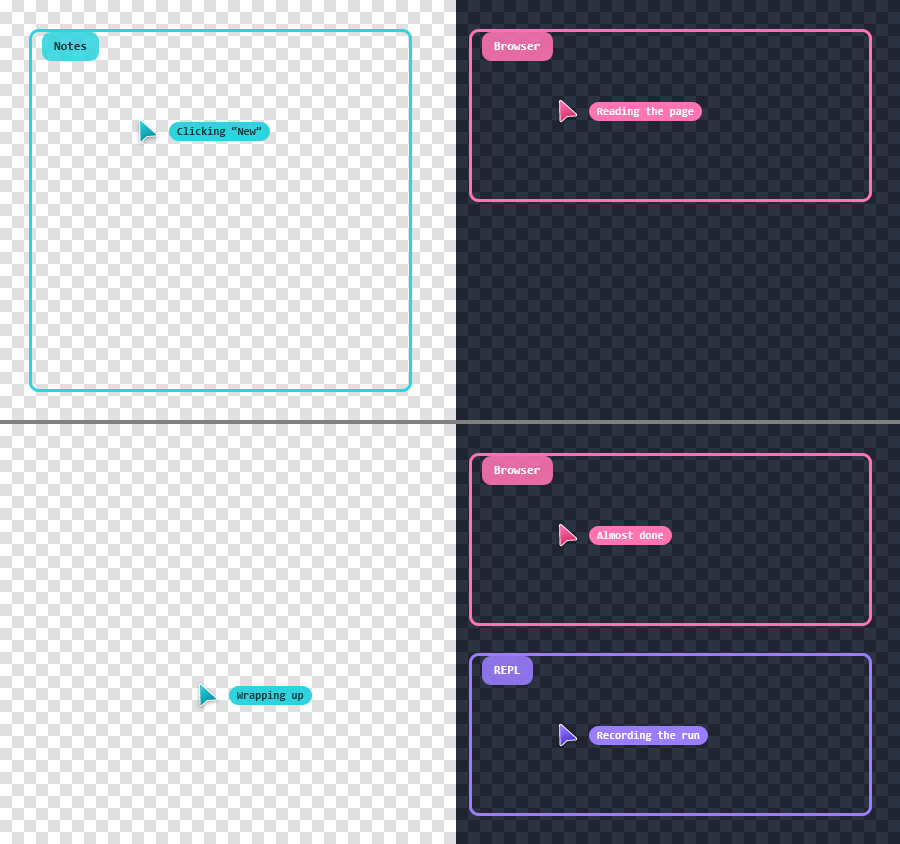
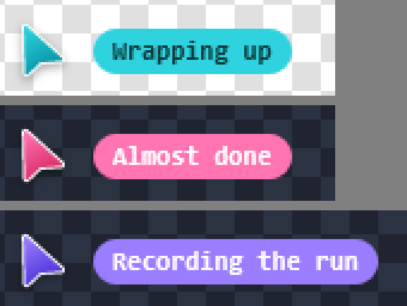
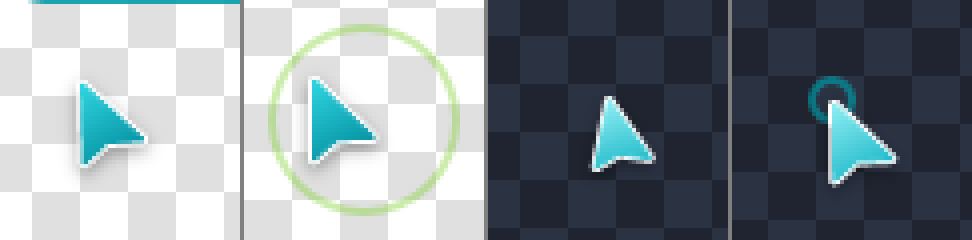
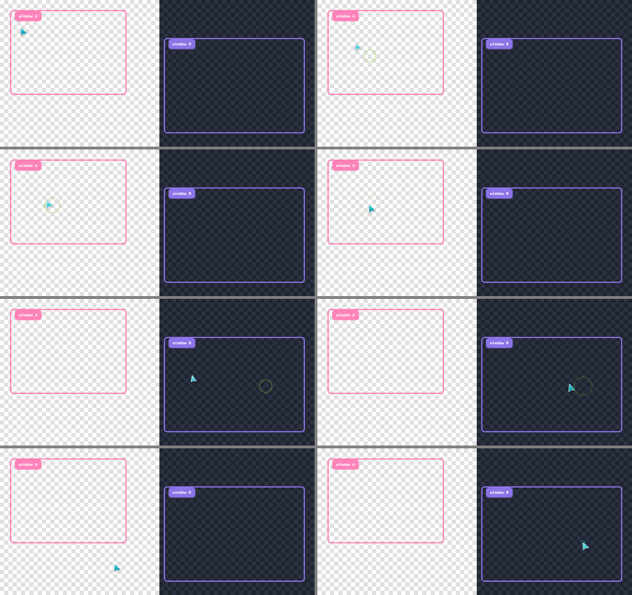
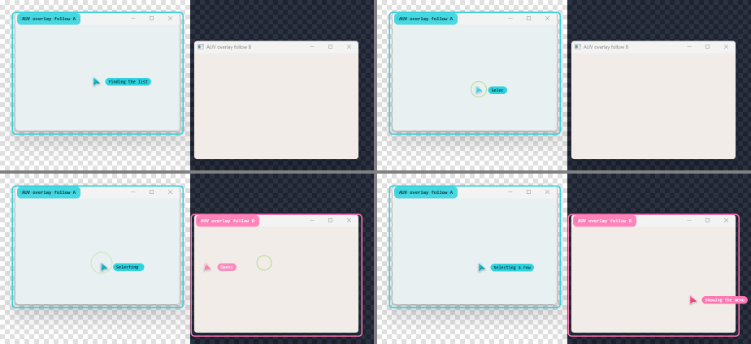

# Windows overlay motion: a live cursor that follows real input

Follows [#306](https://github.com/moeru-ai/auv/pull/306) (the Direct2D renderer).
Owner direction, 2026-10-10: this is a product feature of the Windows driver, not a
promotional recording. The overlay shows, in real time, what AUV is doing: a cursor that
moves to where AUV acted, a ripple where it clicked, and a mark on each window it targeted,
while the automation never touches the user's real mouse or focus ("beside you, without
taking your mouse").

Owner feedback later the same day: the first version's motion and pointer art did not feel
right. The owner compared rendered side-by-side previews and chose a spring-driven cursor
(tilt while moving, a dip on click, the macOS lime ripple) and the "Vector modern" pointer at
24 px, asking for a more modern look. [Motion](#motion) and
[Built-in cursor art](#built-in-cursor-art) record the result.

A second request the same day, with a screenshot of the website hero: show a status beside
the cursor, and give the pointer a different color for each window when AUV works in several
windows in turn. The owner chose one cursor per window, status text written by the caller,
and keeping the "Vector modern" pointer, recolored.
[One cursor per window](#one-cursor-per-window) records it.

Status: the live cursor and its art are on branch `feat/overlay-windows-motion`
([#328](https://github.com/moeru-ai/auv/pull/328)); per-window cursors and statuses are on
`feat/overlay-windows-cursor-status`, stacked on it. Evidence level for the Windows live
overlay is `live-validated` on one machine (see [Evidence](#evidence)); it is not
`supported`.

## Contract

```text
driver delivers input (SendInput, posted window messages, logical mouse)
  -> auv-driver-windows reports ActionEvent after delivery succeeded
  -> LiveOverlay / Animator (auv-driver-overlay-windows), 60 fps frame loop
  -> MotionScene composes an Overlay for that instant (auv-driver-overlay-common, pure)
  -> the existing one-shot renderer presents it (window::present)
```

The renderer stays one-shot. The animator calls it once per frame with the layers the scene
composes for that instant. This matches the shared rule in
[`TERMS_AND_CONCEPTS.md`](../../../TERMS_AND_CONCEPTS.md#live-overlay): callers report
actions, the adapter owns animation timing, and no caller drives frames across the platform
seam.

### Events (provisional names)

`ActionEvent` is the overlay's projection of what a driver did. It is not a tracing event
and not a second action-result schema; `InputActionResult` stays the delivery record.

| Event | Reported when | Visual |
| --- | --- | --- |
| `Moved { point, travel: Jump, window }` | A pointer warp or the first delivered sample of a movement | The cursor springs there from wherever it is drawn |
| `Moved { point, travel: Sampled, window }` | A later sample of a timed trajectory the driver is already playing | The cursor follows with a short spring, about 25 ms behind |
| `Clicked { point, button, window }` | A click was delivered, once per press | A ripple at the true point and time; the cursor shows its pressed art and dips in size for 180 ms |
| `WindowTargeted { id, frame, label }` | An action was delivered to that window | An outline and label on the window's frame in the window's cursor color; refreshed by later actions, faded and removed 3 s after the last one |

`window` is the `id` of the window the action was aimed at, the same id its
`WindowTargeted` report uses, or `None` for an action aimed at the screen. It picks which
cursor moves (see [One cursor per window](#one-cursor-per-window)).

A caller's status is not an event: it is not something a driver delivered. It goes through
its own call, `set_status(window, text)`, on `MotionScene`, `Animator`, `LiveOverlay` and
`OperationFollower`.

### Faithfulness (visual-trust rules)

1. Every visual comes from an event the driver sent after delivery. A failed delivery
   reports nothing; `Started` of a movement reports nothing because nothing was delivered
   yet.
2. The cursor only moves toward reported points. It never passes the point it is heading
   for, and a turn mid-flight swings at most a quarter of the remaining distance off the
   direct line (unit tests cover both, plus a multi-jump sweep that never leaves the span of
   the reported points).
3. A click ripple appears at the click's true point at the click's true time. It is not held
   back until the cursor arrives, because holding it would drop the ripple of any click
   reported faster than the cursor travels. The consequence is visible in the captures: right
   after a click, the ripple is on the point while the cursor is still arriving.
4. Tilt and the press dip turn and scale the art about its hotspot, so the tip stays on the
   reported point.
5. The overlay sends no input. There is no `SetCursorPos`, `SendInput` or focus call in the
   overlay crates, and `follow_operations` only listens.
6. Only the shared default mouse (zero) drives cursors. A cursor stands for a window, and
   cannot honestly stand for several logical mice.
7. A cursor fades out 4 s after its window's last action or status, shrinking into its tip,
   so a cursor left behind never suggests work that stopped.
8. A status is the caller's own words. The overlay shows it as given, on one line and cut to
   48 characters, and never writes one; the driver sets none.

## Motion

The first version eased every jump with the shared `EaseInOutExpo` over 320 ms. Two problems
made it feel wrong:

- The curve is extreme. It covers 3% of a move in the first 96 ms and 75% in the next 64 ms,
  about four frames at 60 fps, then creeps. A long move read as a pause, a jump and a crawl.
- A new point reported mid-flight restarted the ease at zero speed, so a fast cursor stopped
  dead and set off again.

The live cursor now rides a critically damped spring toward the last reported point
(`motion.rs`, owner-approved from a rendered preview):

- **Jumps** use a 110 ms time constant. The cursor covers about 60% of the way in 110 ms and
  is within a pixel of a 600 px jump after about half a second. Its position is the spring's
  closed-form solution, so any instant is exact whatever the frame rate.
- **Retargeting keeps the cursor's speed.** A new point starts a new spring from the drawn
  position and velocity. Two caps keep it faithful: speed toward the target is capped at
  `ω · distance`, the most a critically damped spring can have without passing its target,
  and sideways speed is capped so a turn swings at most 25% of the distance off the line.
- **Samples** use a 25 ms time constant, so the cursor trails a driver-timed stream by about
  25 ms. This smooths uneven sample arrival without a visible delay.
- **Settling is exact.** Once a spring can no longer move by 0.05 px it reports its target
  exactly, and the scene goes idle.
- **Tilt.** The art turns clockwise with rightward speed (0.006 degrees per px/s, at most
  14 degrees), so the body trails the tip. The tilt follows the speed with an 18/s lag, which
  smooths the speed changes between a stream's samples. It is the one piece of scene state
  that advances per drawn frame rather than in closed form.
- **Click.** The pressed art shows for 180 ms while the cursor dips to 84% of its size and back
  along half a sine. The ripple uses the macOS click ripple's geometry
  (`drawFlashRippleIfActive` in `Overlay.swift`): a 2 px ring growing from 3 to 28 px with an
  ease-out cubic, fading from 0.7 over 450 ms. Left clicks are lime (`AUV_LIME`), right clicks
  AUV cyan and middle clicks white.
- The ripple is still an existing `Outline` layer (a square with a half-side corner radius). No
  new `Layer` variant was needed.

The shared `Easing` / `MotionOptions` contract is unchanged and still governs one-shot
overlays (macOS animates its cursor per `show` call). The live overlay has its own motion, so
`Animator::start`, `LiveOverlay::start` and `OverlayApi::follow_operations` take
`LifecycleOptions` instead of `ShowOptions`. `Easing::apply` and `MotionOptions::progress`,
added earlier on this branch only for the live scene, were removed with it. The original
brief's "no second easing" constraint is superseded for the live cursor by the owner's choice.

The pose is a new field on the shared cursor layer: `CursorPose { tilt_degrees, scale }`,
serialized only when it is not at rest. Only the live scene sets it. The Runner wire format
does not carry it (NOTICE at the field), and the macOS adapter ignores it
(`TODO(overlay-live-macos)` at its cursor mapping).

## One cursor per window

The owner's choices (2026-10-10), from three options each: one cursor per window rather than
one cursor recolored as it moves, status text written by the caller rather than generated
from actions, and the "Vector modern" pointer recolored rather than the website's ghost
shape.



**Cursors.** `MotionScene` keeps one cursor per window id, plus one for actions aimed at the
screen. Each moves with its own spring, tilt and press exactly as in [Motion](#motion).

- **Colors.** Windows take colors in the order the scene first sees them: AUV cyan
  `#2fd3df`, pink `#ff74b1`, violet `#9b7dff`, lime `#86d94a` and amber `#ffb238`, then the
  colors repeat. They are the website hero's ghost colors (`GHOSTS` in
  `apps/docs-website/src/theme.ts`), except that the cyan is the pointer's own AUV cyan, so a
  run in one window looks as before. A window keeps its color for the life of the scene, and
  its mark outline and title pill use it too.
- **Hand-off.** A window's first cursor sets off from wherever the cursor that acted last is
  drawn, keeping that cursor's speed, as if AUV carried its pointer over. The first cursor of
  the scene has nothing to travel from and appears on its point. Either way a new cursor grows
  in over 260 ms with a slight overshoot (ease-out-back).
- **Order.** The cursor that acted last is drawn on top.
- **Leaving.** A cursor stays where it last acted. 3.4 s after its window's last action or
  status it starts to shrink into its tip, and it is gone 600 ms later. Its window keeps its
  color, so a cursor that comes back has the same one.
- **Bounds.** At most 16 cursors (the one that acted longest ago is dropped first) and 64
  remembered window colors (NOTICE at both).

**Statuses.** `set_status(window, text)` shows the caller's text in a pill beside that
window's cursor, filled with the cursor's color, with dark text on cyan, lime and amber and
white text on pink and violet, as on the website. The text types out at 28 ms per character, as
the website's ghost labels do, and a new pill fades in over 150 ms. A status that replaces
a showing one keeps the pill up and only retypes. A status counts as activity, so it keeps
its cursor from fading. A status set before any action in its window waits and appears with
the cursor. `None` or blank text removes the pill. Text is shown on one line (control
characters become spaces) and cut to 48 characters with an ellipsis.



**Color on the art.** `CursorStyle` gains an optional `accent`, the color built-in art is
drawn in. The Windows renderer shades the pointer gradient from it: from the accent to a
deeper, more saturated tone (each channel squared, then darkened by 15%), and while pressed
from 45% toward white to 30% toward that deep tone. These factors are fitted to the
hand-picked art: from AUV cyan they give `#0794a6` against the art's `#0896a6`. The white rim
and the shadow do not change. The Runner wire does not carry `accent` and the macOS adapter
ignores it, like the pose.

**Attribution.** The driver now names the window on `Clicked` and `Moved`:

- A window-targeted click names its window on both delivery routes. The foreground route
  used to report the click through the global `click_at`, which reports a screen click, before
  marking the window. It now delivers through `input::deliver_click`, which does not report,
  and reports the mark and the window's click together.
- A movement aimed at a window names it on every sample.
- Global clicks and pointer warps aim at the screen.

**Deliberate differences from the website hero:**

- The pill sits beside the pointer, vertically centered, where the Windows renderer already
  draws cursor labels, not below-right as on the website.
- The pill text uses the overlay's label font, a monospaced semibold face matching macOS
  (`NSFont.monospacedSystemFont` in `Overlay.swift`), not the website's sans.
- Ripples keep their button colors (lime left, cyan right, white middle), not the cursor's
  color.

Nothing outside this API sets a status yet: `auv invoke` and MCP do not start a follower. See
`TODO(overlay-live-status-producers)`.

## What changed

| Crate | Change |
| --- | --- |
| `auv-driver-overlay-common` | `motion` module: `ActionEvent`, `Travel`, `MotionScene` (one cursor per window with spring, tilt, press and status; ripples; marks), `MotionFrame`, `Wake`; `FrameStats` / `Percentiles`; `CursorPose` on the `Cursor` layer; `CursorStyle::accent`. Pure and cross-platform. The easing contract in `overlay.rs` is untouched |
| `auv-driver-overlay-windows` | `Animator` (thread, 1 ms timer resolution, message pump, warm-up; `set_status`), `pacing` (render/wait/remove decisions, pure), bounded sample buffer. `window.rs`: an `IsWindow` check so a window destroyed with its owner thread is recreated. Built-in cursor art shaded from an accent, cursor pose and silhouette shadows, below |
| `auv-driver-overlay` | `LiveOverlay` facade with `set_status` (Windows adapter; `Unavailable` elsewhere) |
| `auv-driver-windows` | `OverlayApi::follow_operations`, `OperationFollower::set_status` and the report sites below; `overlay_follow` example |
| `auv-core`, `auv-cli` | A NOTICE that the Runner wire does not carry `CursorStyle::accent` |

Report sites (`auv-driver-windows`, behind the `overlay` feature, after successful delivery):

| Site | Reports |
| --- | --- |
| `input::click_at` (global `SendInput`) | `Clicked` per press, aimed at the screen |
| `WindowApi::click` | `WindowTargeted`, then `Clicked` per press aimed at that window, on the background and the foreground route |
| `InputApi::move_mouse` (mouse zero) | The target window if any, then `Moved` per delivered sample, aimed at that window |
| `InputApi::move_mouse_to` (mouse zero) | `Moved { Jump }`, aimed at the screen |

## Built-in cursor art

Resolves `TODO(driver-overlay-windows-builtin-art)` and
`TODO(driver-overlay-windows-silhouette-shadow)`.

The owner picked the pointer from four rendered candidates: the 12 x 12 brand sprite, a fine
1 px pixel arrow, a classic vector arrow and a rounded vector dart. They chose the dart
("Vector modern") at 24 px. `assets/cursor-pointer.svg` draws it:

- A white rim 3.12 units wide with round joins, then the fill and a 1.2 unit stroke of one
  gradient over its inner part, leaving about one unit of white outside the colored shape.
- Gradients per variant: AUV `#2fd3df` to `#0896a6`, pressed `#8cecf2` to `#25bccb`, the user
  cursor `#51647f` to `#2a3a52`. A style `accent` replaces them with a gradient shaded from it
  (see [One cursor per window](#one-cursor-per-window)).
- The hotspot is (1, 1) of the 24-unit box, the outermost point of the rounded tip, so the rim
  ends exactly on the point the operation acted on.
- Built-ins cast a soft drop shadow by default (black at 35%, blur 4, 1.5 px down); a
  transparent style shadow turns it off.

Every cursor shadow, built-in or custom, is now a blur of the art's own silhouette instead
of the radial glow #306 used. The posed art is rasterized a second time at the shadow's
offset, its alpha is blurred with a separable Gaussian (sigma = blur radius / 2, as on
macOS) and painted under the art, all on the CPU in the resvg bitmap. `Canvas::draw_glow`
and `Canvas::fill_circle` are gone. The pose is applied when rasterizing, so a tilted
cursor is a crisp vector rotation, not a resampled bitmap. A posed bitmap is capped at
2048 px per side, so an untrusted pose cannot blow up the allocation.



The old pixel arrow (`assets/cursor-pixel.svg`) is removed. Two deliberate gaps:

- The preview also drew short lime "burst" ticks around the tip during a press. They were
  left out: the dip and the lime ring already mark the click, and the owner asked for a more
  modern, quieter look.
- macOS still draws the 12 x 12 brand sprite with its mint glow
  (`BuiltInCursor::svg_source`). Giving macOS the same pointer is a separate slice.

## Evidence

Machine: Windows 11 Pro Insider Preview 10.0.29648, NVIDIA GeForce RTX 4070 Ti (not used:
the renderer is a software target), one 2560 x 1440 display at 100% scaling, 180 Hz.
Runs on 2026-10-10 in release mode on `feat/overlay-windows-cursor-status` (`ed586c08` plus
the per-window change). Numbers from the first round, on `5a567ab0`, are marked as such.

### Unit tests (cross-platform unless noted)

- `auv-driver-overlay-common` (37 motion tests): a jump follows the straight line, covers
  1 - 3/e^2 of the way at one time constant, never moves more than 2.1 px per millisecond over
  300 px and settles exactly; the scene stops drawing, upright, after a jump; a retarget keeps
  the cursor's speed (regression for the stop-and-restart); a retarget never passes its new
  target; a sideways turn swings at most 25% of the distance; the cursor never leaves the span
  of reported points; a 1 px/ms sampled stream is followed 15 to 35 px behind; tilt direction,
  limit and rest; no tilt on vertical moves; the press dips to 0.84 about the click point; the
  left-click ripple matches the macOS ripple; ripple growth, fade, bounds and colors; window
  marks. Per window: the first cursor grows in on its point; each window gets its own cursor
  and color, and screen actions their own; a window's first cursor sets off from the cursor
  that acted last while that one stays; the cursor that acted last is on top; a quiet cursor
  shrinks into its tip and leaves; a window keeps its color when its cursor comes back; marks
  take the cursor's color; cursors are bounded. Statuses: typing beside the cursor in its
  color, retyping in a pill that stays up, keeping the cursor alive, waiting for the first
  action, clearing (including blank text), one line and 48 characters.
- `auv-driver-overlay-windows` (Windows): `pacing` and `stats`; rasterizer tests for a
  clockwise tilt and a scale about the hotspot, an unblurred shadow exactly under the
  silhouette, a blurred shadow fading monotonically inside the bitmap, a transparent shadow,
  rejected poses, the cyan accent reproducing the hand-picked gradient, an accent tinting the
  body while the rim stays white, and rejected accents; window pixel tests for the tip on the
  target pixel, the white rim and cyan body, the pose about the tip, the default shadow on and
  off, distinct variants, a pink accent, and a custom SVG's silhouette glow.
- `auv-driver-windows` (11, `--features overlay`): one click event per press; a click aimed at
  a window names that window; window and label mapping; a movement reports nothing until it
  delivered a sample, jumps first and follows after; a window-targeted movement marks the
  window once and names it on every sample; one follower per process.
- `cargo test --workspace`: 1286 passed, 0 failed, 12 ignored.

### Timeline harness (Windows)

```text
cargo run --release -p auv-driver-overlay-windows --example overlay_motion_timeline -- <out-dir>
```

Passes 1 and 2 play a scripted timeline (two window marks, two clicks 617 px apart, a 125 Hz
sampled drag, a right click) through the real animator over an owned backdrop, with the
screen captured continuously. These actions aim at the screen, so one cyan cursor moves, and
the marked windows take pink and violet. The harness finds the pointer in each capture by its
body color, which no other layer uses (the first run with the new art matched a window
mark's antialiased corner; the color test now also requires the pointer's saturation).

Pass 3 acts in three windows in turn (Notes, Browser, REPL), each click aimed at its window,
with a status for each and a second status for two of them. On the last capture it checks,
for each window, that the pixels around its last point are its own color and no other
window's, and that a pill of its color sits beside the cursor. The harness is for developing
and testing the animation; it is not the product.



| Measurement | Result |
| --- | --- |
| Frame time (compose + present) | P50 8.5 ms, P95 9.2 ms, max 10.6 ms, 170 frames (first round: P50 11.0 ms, P95 12.3 ms) |
| Late frames | 0 |
| Event latency (report to `present` returned) | P50 16.9 ms, P95 25.5 ms, max 26.2 ms |
| Click-to-click jump, 617 px | 44 captures strictly between the endpoints (first round 56, and 23 with the old ease; how many captures fit depends on how fast the screen can be read); largest step between captures 72 px, 12% of the distance (183 px with the old ease); at most 0.9 px off the straight path; the last capture in the window is 3 px from the point (the spring's last pixel or two of settling, plus the body color starting a pixel inside the white tip) |
| Sampled drag | The pointer was at most 56 ms (74 px at 1.33 px/ms) behind the driver's sample, including the 25 ms the stream's spring trails by. The check allows 75 ms: the pipeline's own delay (about 50 ms) plus that spring |
| Per-window cursors (pass 3) | Notes, Browser and REPL: 90, 84 and 82 pixels of their own color around their last points, 0 of another window's; 1187, 1208 and 1325 pixels of their pill's color beside them |

Frame time fell from the first round with no renderer change; the machine's load differs
between runs, so treat it as run-to-run variation.

### Real operations through the driver (Windows)

```text
cargo run --release -p auv-driver-windows --features overlay --example overlay_follow -- <out-dir>
```

The example opens an opaque backdrop and two top-level windows of its own, finds them through
`list_windows`, and performs real operations through `WindowsDriverSession` while
`follow_operations` runs: a 500 ms logical-mouse movement posted to window A, a click in A,
then a left and a right click in B. Before each step it sets a status for that window through
`OperationFollower::set_status`. It never calls `SendInput`, `SetCursorPos` or any focus API.
Captures contain only the backdrop and the example's windows.



| Check | Result |
| --- | --- |
| The driver delivered what it reported | A received 1 click and 31 move messages; B received 2 clicks |
| No mouse or focus disturbance | All four `InputActionResult`s: `selected_path` `window_targeted_mouse`, `mouse_disturbance` and `focus_disturbance` `none` |
| Two real windows annotated at once | Both windows outlined and labelled with their titles in the captures, A in cyan and B in pink |
| Each window's cursor and status in its color | A: 90 cyan pixels around its last click and 1370 in its status pill; B: 84 pink and 1320; 0 of the other window's color around either cursor |
| Ripple at the real click points | Visible at the clicked point in A and B |
| Frame time | P50 8.5 ms, P95 9.8 ms, 90 frames, 0 late frames, 0 present failures (first round: P50 11.0 ms, P95 12.4 ms) |
| Event latency | P50 15.8 ms, P95 27.1 ms |

The OS pointer and the foreground window are printed before and after as information only: a
person using the machine can move either while this runs (a first version of this check failed
exactly because the machine's user moved their mouse), so the typed delivery record above is
the assertion. In the recorded run neither changed.

## Known limits

- **Cost.** A frame is a full virtual-screen software render, 8.5 to 11 ms of every 16.7 ms
  while animating across runs (half to two thirds of one core, derived from frame time, not
  separately measured). Each visible cursor is rasterized every frame. The CPU silhouette shadow adds about half a millisecond over the radial glow. It is
  idle when nothing moves. Multi-monitor virtual screens, which make the bitmap larger, were
  not measured. Reusing the bitmap between frames or presenting only a dirty rectangle is a
  `canvas.rs` change and was left out on purpose.
- **Latency.** About one frame of pacing plus about one frame of render separate a driver
  event from the frame that shows it (P50 16 to 20 ms). The spring adds its own, on purpose: a
  jump covers about 60% of the way in 110 ms and settles in about half a second, and a sampled
  stream is drawn about 25 ms behind.
- **Tilt depends on frame times.** It is smoothed per drawn frame, so two runs with different
  frame timing tilt very slightly differently. Position never depends on frame timing.
- **One animator per process, and the sole presenter.** The window belongs to the thread that
  first presents, so mixing a running animator with one-shot `render` from another thread can
  stall (`TODO(driver-overlay-windows-window-owner-thread)`).
- **Start-up.** `Animator::start` returns after a warm-up of 40 to 330 ms, because the first
  Direct2D/DirectWrite use otherwise produced a 120 to 330 ms first frame.
- **Coordinates and DPI.** Positions are the physical screen pixels drivers already use; not
  validated at scaling other than 100%.
- **Real applications.** The evidence drives windows the example owns. It does not click into
  third-party applications on a person's desktop.
- **Screen actions.** A global click or pointer warp moves the screen's cursor, even when the
  point lies inside a window that has its own cursor: the driver does not hit-test which
  window was under the point.
- **Colors repeat** after five windows, so the sixth window shares the first one's cyan.
- **CI.** Not run from this machine; Windows CI is the gate.

## Deferred (markers in code)

- `TODO(overlay-follow-other-input)`: scroll, key, text and held-button delivery report
  nothing. A click-shaped ripple for a scroll would imply an action that did not happen.
- `TODO(overlay-follow-remote-runner)`: events are reported inside the process that delivers
  input. A Runner serving remote callers needs the same hook at its own seam.
- `TODO(overlay-follow-multi-mouse)`: only mouse zero drives cursors.
- `TODO(overlay-live-status-producers)`: nothing outside the Rust API sets a status, because
  `auv invoke`, MCP and the Runner do not start a follower. Wiring a producer belongs with
  starting the follower from the CLI.
- `TODO(overlay-motion-event-wire)`: `ActionEvent` is in-process; no serialization or tracing
  event until an out-of-process consumer needs it. The cursor pose and `CursorStyle::accent`
  are not on the Runner wire for the same reason.
- `TODO(overlay-live-theme)`: the host theme applies to one-shot `show` only.
- `TODO(overlay-live-macos)`: macOS already animates natively per `show`; routing live events
  there, and drawing the cursor pose and accent, is a separate slice.
- `TODO(driver-overlay-windows-window-owner-thread)`: see Known limits.
- Still open from #306: `TODO(driver-overlay-windows-outline-label)`.

## Questions for the owner

1. Click ripples appear at the click's true time while the cursor may still be arriving
   (rule 3). The alternative, showing the ripple on arrival, looks tidier for a single click
   but hides clicks reported faster than the cursor travels. Keep the faithful behavior?
2. Should the evidence also include clicks into a real third-party application, or is
   harness-owned windows plus the typed delivery record enough?
3. Should macOS adopt the rounded pointer, and the spring for its own cursor moves, or keep
   the brand pixel sprite?
4. The press "burst" ticks from the preview were left out (see above). Add them back?
5. Status pills use the overlay's monospaced label font (macOS parity). The website hero uses
   a sans font. Switch the pill font, on Windows only or on both platforms?
6. The pill sits beside the pointer, not below-right as on the website. Keep it?
7. Ripples keep their button colors. Should they take the cursor's color instead, as on the
   website?
8. A cursor stays 4 s after its window's last action or status. Is that the right length?
