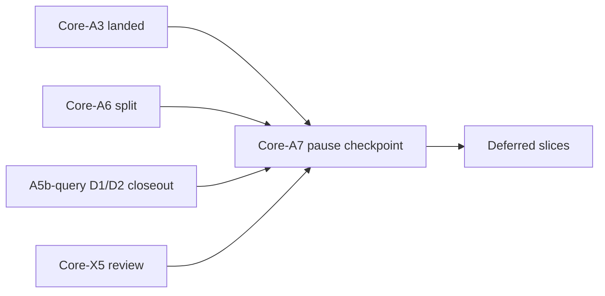

# 2026-06-30 AUV Core-A7 extraction boundary owner pause checkpoint

Date: 2026-06-30

Status: **owner pause checkpoint** — records which Core-A helper/graduation
lanes are **closed**, which implementation/extraction paths remain **deferred**,
which triggers are allowed to reopen them, and which misreads are explicitly
forbidden. **No new extraction or implementation is approved by this note.**

## Scope boundary

**In scope:**

- Closed-lane inventory for the current Core-A helper / graduation thread
- Frozen defer list for implementation and extraction slices
- Reopen triggers that an owner or new evidence must explicitly name
- Anti-misread rule for `helper-only admissible`

**Out of scope:**

- Proof-matrix row edits or verdict changes
- Re-running falsifier analysis already recorded in closed notes
- Opening any deferred extraction or implementation slice
- Core-B, MC-20, controller/planner/registry work
- Tombstone edits in earlier closed notes

This is a **boundary record**, not a new implementation proposal.

## Purpose

After:

- Core-A3 code landing,
- Core-A6 row-70 split owner decision,
- Core-A5b-query D1/D2 docs-only closeout,
- and Core-X5 post-X4 re-adjudication,

agents now have enough material to repeatedly invent “obvious next” extractions
that are **not actually approved**. This checkpoint exists to stop that drift.

## Closed phases

These phases are **done** for their named scope. “Closed” here means the phase
reached its intended endpoint and should not be reopened without a new owner
slice.

| Phase | Closure type | Pointer | What “closed” means |
| --- | --- | --- | --- |
| **Core-A3** | **Code landed** | [`2026-06-29-auv-core-a3-stage-status-triad-helper-design.md`](2026-06-29-core-stage-status-triad-helper-design.md), `crates/auv-stage-status` | Stage-status triad helper extraction landed; row 65 helper lane is complete for A3 scope |
| **Core-A6** | **Owner decision** | [`2026-06-30-auv-core-a6-row-70-split-owner-decision.md`](2026-06-30-query-readiness-closeout.md) | Monolithic row 70 retired; replaced by **70a / 70b / 70c**; **no code extraction approved** |
| **Core-A5b-query D1** | **Docs-only contract** | [`2026-06-30-auv-core-a5b-query-d1-query-backend-label-contract.md`](2026-06-30-core-query-backend-label-contract.md) | Row **70a** query-backend label contract frozen; label vocabulary and wire discipline recorded; serde and manifests stay donor-local |
| **Core-A5b-query D2** | **Docs-only closeout** | [`2026-06-30-auv-core-a5b-query-d2-falsifier-graduation-review.md`](2026-06-30-query-readiness-closeout.md) | 70a keeps **helper-only admissible** review language; **F4 + F-nominal-abstraction** block D3; chain ends without trait crate |
| **Core-X5** | **Graduation review** | [`2026-06-30-auv-core-x5-post-x4-third-donor-graduation-review.md`](2026-06-30-core-post-third-donor-graduation-review.md) | Post-X4 rows 69 / 70x re-adjudicated; verdict columns unchanged; does **not** unlock A5a or A5b extraction |

## Continue defer

These slices remain **frozen by default**. The default answer to a new agent
proposal in these lanes is **no** unless a named trigger fires and the owner
names the reopened slice explicitly.

| Deferred slice | Matrix / track | Current state | Why still defer |
| --- | --- | --- | --- |
| **Core-A5a implementation** | Row **69** quality verdict | A5a-prep mapping only (proof-matrix footnote **⁹**) | Three incompatible `metric_partial` policies; F3 divergence unchanged after X5 |
| **Core-A5b-query extraction (D3)** | Row **70a** | D1/D2 docs-only closeout (proof-matrix footnotes **¹³ / ¹⁴**) | F4 still open; F-nominal-abstraction still open; Core-A6 does **not** approve extraction |
| **Core-A5b-render** | Row **70b** | `candidate, not admissible yet` | MC-only render enum; no second render donor |
| **Core-A5b-quality** | Row **70c** | `candidate, not admissible yet` | MC `render_backend` vs Balatro `quality_backend` vs osu strings; no donor-neutral quality-backend contract |
| **Core-B** | Broader enum / contract graduation | Blocked by proof-matrix and closed-note non-goals | Helper-only admissible rows do **not** imply Core-B extraction pressure |
| **MC-20 / controller** | Minecraft orchestration | Explicitly outside the Core-A consumption-proof lane | Separate vertical/orchestration lane; not reopened by Core-A helper evidence |

See:

- row **69** and footnote **⁹** in [`2026-06-27-auv-core-spatial-result-consumption-proof-matrix.md`](2026-06-27-core-spatial-result-consumption-proof-matrix.md)
- row **70a** and footnotes **¹² / ¹³ / ¹⁴** in [`2026-06-27-auv-core-spatial-result-consumption-proof-matrix.md`](2026-06-27-core-spatial-result-consumption-proof-matrix.md)
- row **70b** and **70c** in [`2026-06-27-auv-core-spatial-result-consumption-proof-matrix.md`](2026-06-27-core-spatial-result-consumption-proof-matrix.md)

This note does **not** modify those rows; it records the current pause boundary.

## Reopen triggers

Nothing above reopens “because it feels next.” A deferred lane reopens only when
someone names **which trigger fired** and **which exact slice** is being
reopened.

| Trigger | Unlocks (candidate only) | Does **not** auto-unlock |
| --- | --- | --- |
| **New shared consumer pressure** | Re-adjudicate **70a F4** for `Core-A5b-query D3` candidacy | D3 implementation without a separate owner D3 approval |
| **Second render donor** | Revisit **70b** / `Core-A5b-render` | Query extraction, Core-B, or quality helper work |
| **Quality-backend semantic convergence** | Revisit **69** (`Core-A5a`) and/or **70c** (`Core-A5b-quality`) | Query-backend helper extraction |
| **Owner explicit extraction approval** | Named slice only (for example, `Core-A5b-query D3`) | Adjacent slices, bundled helper work, Core-B, or MC-20 |

**Trigger met ≠ implement.** Even after a trigger fires, the lane still needs:

1. a named slice,
2. a fresh falsifier / scope pass where applicable,
3. and explicit owner approval for implementation.

That is the same D1 → D2 → stop pattern already recorded for Core-A5b-query.

## Anti-misread rule

This is the most important section in this note.

> **`candidate, helper-only admissible` is review language only.**
> It means the recurrence is strong enough to discuss a bounded helper honestly.
> It does **not** mean “write a crate now.”

### Forbidden misreads

The following readings are explicitly rejected:

- “70a is admissible, so implement `QueryBackendLabel` now”
- “D1 contract exists, so centralize serde / enum ownership in a crate”
- “D2 closeout passed, so D3 is the obvious continuation”
- “helper-only admissible means Core-B is now closer”
- “docs-only closeout means the row should be downgraded back to `not admissible yet`”

### Why 70a did **not** become A3 part two

Core-A3 and 70a are not the same shape.

| Dimension | Core-A3 `StageStatus` | 70a query backend |
| --- | --- | --- |
| Shared enum identity | Yes | No |
| Shared serde contract ownership | Yes | No |
| Variant set sameness | Yes | No |
| Donor-neutral consumer pressure | Strong enough for helper | Not yet strong enough |
| Docs-only endpoint acceptable | No — extraction landed | Yes — D2 closes at docs-only |

That is why Core-A3 legitimately landed `auv-stage-status`, while Core-A5b-query
D2 legitimately ends in **defer**, not “A3 again.”

### Allowed readings

The following readings are allowed:

- 70a recurrence is real enough to justify a **bounded contract note**
- 70a review language remains **helper-only admissible**
- D2 honestly keeps that language **while still blocking extraction**
- New evidence may reopen the lane **only through named triggers**

### Practical filter for future proposals

If someone proposes a next slice from this lane, ask:

1. **Which exact row or track is being reopened?**
2. **Which named trigger fired?**
3. **Is this docs-only review, or code extraction?**
4. **Where is the explicit owner approval if code extraction is proposed?**

If those answers are missing, the proposal is outside the current boundary.

## Related references

- Stage helper extraction landed:
  [`2026-06-29-auv-core-a3-stage-status-triad-helper-design.md`](2026-06-29-core-stage-status-triad-helper-design.md)
- Row 70 owner split:
  [`2026-06-30-auv-core-a6-row-70-split-owner-decision.md`](2026-06-30-query-readiness-closeout.md)
- 70a contract:
  [`2026-06-30-auv-core-a5b-query-d1-query-backend-label-contract.md`](2026-06-30-core-query-backend-label-contract.md)
- 70a docs-only closeout:
  [`2026-06-30-auv-core-a5b-query-d2-falsifier-graduation-review.md`](2026-06-30-query-readiness-closeout.md)
- Post-X4 third-donor review:
  [`2026-06-30-auv-core-x5-post-x4-third-donor-graduation-review.md`](2026-06-30-core-post-third-donor-graduation-review.md)
- Quality verdict prep:
  [`2026-06-30-auv-core-a5a-prep-metric-partial-cross-donor-mapping.md`](2026-06-30-query-readiness-closeout.md)
- Backend split prep:
  [`2026-06-30-auv-core-a5b-prep-backend-label-discipline-split-review.md`](2026-06-30-query-readiness-closeout.md)
- Proof matrix:
  [`2026-06-27-auv-core-spatial-result-consumption-proof-matrix.md`](2026-06-27-core-spatial-result-consumption-proof-matrix.md)

## One-sentence summary

Core-A7 freezes the current Core-A helper / extraction lane after A3, A6,
Core-A5b-query D1/D2, and X5: implementation and extraction paths stay
**deferred** until a named trigger and owner-approved slice reopen them —
**helper-only admissible never means write a crate now**.
